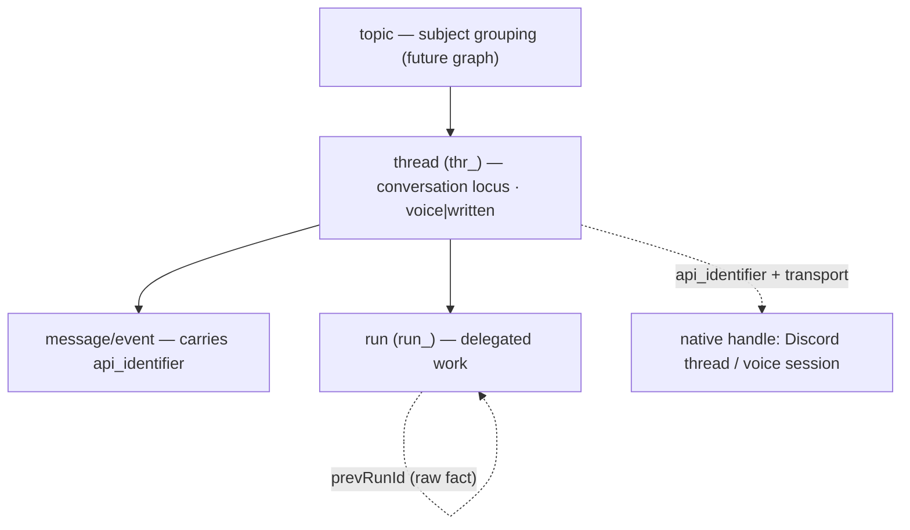
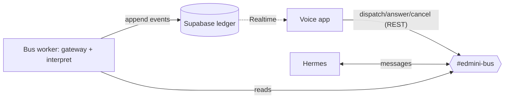

# edmini — Development Journal

> A working journal for **edmini**, a voice agent that supervises autonomous executors. It is
> **rich raw material to tell stories from later — not the finished blog post.** Capture the
> specifics: real decisions + reasoning, alternatives, dead ends, surprises, and concrete changes
> (file paths, code snippets, commands, results, diagrams), plus **direct quotes of pivotal dialog**.
> Detail over brevity (don't over-condense); narrative is welcome when it describes something
> specific. Entries dated, newest first. (Style refined 2026-06-19; earlier narrative entries
> archived verbatim in [`docs/journal-archive.md`](docs/journal-archive.md). File-change logs:
> `docs/SESSION_SUMMARIES.md`.)

## Project overview

edmini is a voice-first *supervisor*: it has no task-execution capabilities of its own and instead
coordinates an external agent harness (initially Hermes) on the user's behalf. Its hard problem is
**attention accounting** — protecting a single human's single-stream voice attention across many
asynchronous agent runs, letting the person decide what is *important* while the system computes
only what is *relevant*, and maintaining a complete, accountable record so that no result the user
produced ever silently disappears.

## Journal Entries

### 2026-06-22 — closing the speaker-identity workstream: one fact, a docs check, and a visible state

The tail of the roster work, where the user's questions did the most for the design.

**"why don't we have a single consistent way of persisting the person identified?"** A sharp architectural
catch. The honest state was three treatments of one fact: the UI got a speaker on every turn, the ledger
got one only on the retained-guest path (your *own* turns logged anonymous), and the value was the raw
classifier label — which could read "unknown" on a turn the gate had just accepted as you. I unified it to
a single `turnSpeakerRef` resolved once per turn (the principal's name when the gate responds — *not* the
raw label; the member's name when retained), written to the ledger and the UI from that one value. The
ledger is the single source; everything else derives from it — exactly the v1 "everything derivable from
the ledger" principle the codebase already runs on. The refactor *removed* code (a whole divergence) and
fixed two latent bugs in passing (anonymous principal turns; "unknown" leaking onto your own turns).

**"have you checked the openai api documentation?"** The best two-word correction of the session. I'd
asserted, twice, that the live OpenAI context "can't hold a speaker field" — from memory, the exact sin
this whole arc kept punishing. So I actually pulled the OpenAI OpenAPI spec and grepped it:
`RealtimeConversationItemMessageUser` is `id/object/type/status/role/content` — **no `name` field**, unlike
Chat Completions' `message.name`. The claim was right, but I shouldn't have stated it unverified. With it
confirmed, the in-session adapter is principled, not a workaround: for a retained turn we delete OpenAI's
nameless audio item and inject our own attributed text item (`role:user`, `"Roger: …"`), rendering the
same `turnSpeakerRef` into the one channel that can't hold it structurally. Now ledger, UI, and live model
context all derive from one fact. (`create_response:false` keeps Ed aware-but-silent.)

**"I don't see 'speaker grading active' — I only see a toggle."** The status lived in the event log, not the
header — so "is grading actually on, and did the model load?" was invisible. Added a live header indicator
off real VAD state: `active — George` / `listening · enroll to gate` / `unavailable · responding to all` /
`start a session to activate`. That doubles as the on-device confirmation for `5on` (Blob hosting): if it
says "active," the model loaded. The recurring shape of this whole workstream: the principal is the default
partner, everyone else is *named*, and the system shows you what it's doing.

**Closed the workstream.** Speaker identity went from a feedback-loop bug to: TS-VAD engine → grade-and-
suppress → English bake-off (CAM++ zh_en) hosted on Blob → grade chip + name → identify-only roster →
remember-and-attribute guests, in-session and durably, one fact, with a visible state. Marked the
device-confirmed beads verified (5on, q1e, dcv, bf0, 1wm, d6z). Parked, clearly named: `hy8`'s toggle-drop
(grading-on-when-enrolled, which also closes the beep phantom `put`), `ce9` threshold re-tune, the
`tsvad-lab` legacy-key cleanup (`xcs`), and the voice E2E harness (`7fn`).

**Content potential:** "the two-word code review" — *have you checked the docs?* — and how the best design
moments in this arc were the user refusing to let an assertion stand. And the unification as a worked
example of "record the fact once, derive every view," with the one channel that needs a text adapter
proving the rule rather than breaking it.

---

### 2026-06-22 — the multi-speaker roster, built iee-way, and the integration gate earning its keep

Shipped the `q1e` thin slice — manual, **identify-only** multi-speaker enrollment — as a four-task,
subagent-driven build in an isolated worktree, the same machine that built `iee`. The shape: a roster of
N named centroids (one principal); the pipeline scores each window against every member (embed once,
cosine to each — the roadmap's "N≈free"); the **principal's** score still drives the respond/suppress
gate, **byte-identical** to before; an N-way `SpeakerClassifier` (built earlier in `ce9`) runs in parallel
and labels each turn with a name, for display only. Ed identifies everyone, acts on you.

The load-bearing constraint was back-compat: *with only the principal enrolled, behavior is identical to
today.* The way to guarantee that against a refactor of a verified audio path was to extract a pure
`scoreWindow(emb, members, principalId)` helper and pin `raw = principal's cosine` with a unit test, then
let the opus task-reviewer trace it byte-for-byte against the old `cosineSimilarity(emb, centroid)`. It held.

**The story of the build was the final review catching what four green task-reviews didn't.** Removing a
roster member needed a decision the plan hadn't fully specified: what happens when you remove *yourself*
(the principal)? The Task-4 reviewer flagged that the UI silently promoted a random other member to
principal; I dispatched a fix that set `principalId = null` (→ pass-through) at the UI layer, and the
task went green. But the **opus whole-branch review** found the fix was *undone one layer down*:
`applyRoster` in the pipeline had `principal = members.find(...) ?? members[0]`, so `setRoster` re-promoted
`members[0]` to principal regardless — re-pointing the respond/suppress gate at *another person's voice*,
the exact privacy-adjacent surprise the fix was meant to prevent. A latent invariant violation that would
have merged green, reachable only by the remove-the-principal path the acceptance check wouldn't exercise.
Fixed by extracting a pure `selectPrincipal(roster)` that returns null for a null `principalId` and never
promotes, with four unit cases. *That* is what the integration gate exists for: per-task reviews verify a
task; the whole-branch review verifies the seams between them, including a fix that was right in one file
and wrong in another.

A smaller lesson, twice over: a haiku fix subagent's environment rewrote `pnpm-lock.yaml` (the old pnpm
8-vs-9 skew) into its commit — 10k lines of churn that nearly rode the merge. Caught it on the branch-delta
scan, restored the lockfile from main. Worth a standing reminder in the per-task contract: never let a
subagent commit the lockfile.

**Content potential:** "the bug that was fixed in the UI and unfixed in the engine" — a concrete case for
why a whole-branch review is not redundant with green per-task reviews. And the broader arc of these two
days: every speaker-identity feature — grade-and-suppress, the grade chip, the name, the roster — converging
on one idea, *identify before you act*, with the gate as the single decision point that each layer feeds.

---

### 2026-06-22 — enrollment UX: silence during capture, a grade chip, a name, and the roster decision

A run of small, user-driven polish on the speaker-identity feature, each item from the user actually
holding the thing in their hands.

**"during enrollment we should disable edmini…. I was reciting the words and edmini started answering :)"**
The enrollment passage and the live OpenAI session shared one raw mic track, so Ed transcribed the
Rainbow Passage and answered it. The fix is satisfying because of an architectural accident in our favor:
the TS-VAD enrollment reads the mic through its *own* `AudioContext` (`createMediaStreamSource`),
independent of the WebRTC sender — so `replaceTrack(null)` on the PC audio sender mutes the mic *to
OpenAI* (no `speech_started`/`committed` → nothing to respond to) while enrollment capture keeps working.
Narration paused too (`enrollingRef`). "Disable edmini during enrollment" turned out to be one line of
WebRTC, not a redesign.

**The grade chip and the name.** Two requests that pair naturally. First: *"I was expecting a grading
indicator next to the timestamp but i don't see anything."* It wasn't a bug — the grade only ever went to
the debug events panel; showing it on the message is the open `hy8`. So I threaded the speaker-ID
confidence onto the responded turn (enrolled-only — pass-through has no real score) and render it as a
colored dot + number next to the timestamp. Second, the user's idea: *"maybe we should also ask the user
for their name… so edmini can attach a name to the signature."* We agreed to **type it, not speak it** —
dodges both name mis-transcription ("George"→"Georgia") and re-opening the mic mid-enrollment (the bug we'd
just fixed). A skippable step at the end of capture; stored on the `Enrollment`, sent to `/api/session`,
injected into Ed's prompt ("you're speaking with George"). Small, but it's the hook the roster needs.

**Then the roster decision.** *"we should allow enroll (as a manual… way to add another user) right?"* —
yes, and it's `edmini-q1e`, just reached by manual enrollment instead of waiting on the voice-triggered
`enroll_speaker` tool (`6kl`), which I dropped as a blocker. The load-bearing fork I put to the user: when
a second person is enrolled, does Ed *respond* to them, or just *identify* them? He chose **identify-only**
— Ed still acts only on the principal; others get their turns labeled by name. The reason that's the right
call: it keeps authorization (who can command Ed) a separate, deliberate decision from identification, and
it doesn't disturb the grade-and-suppress gate we just verified on device. The elegant consequence: the
N-way `speaker-classifier.ts` (built back in `ce9`) *replaces* the binary grader, and "respond" becomes
simply "classified-as-principal" — one decision point gates the response and attributes the name.

**Content potential:** the enrollment-onboarding arc as a case study in letting real use drive UX — every
one of these came from a person holding the product, not a spec. And the recurring theme of *architectural
accidents that pay off*: the VAD's separate audio graph making "mute Ed during enrollment" trivial.

---

### 2026-06-22 — live-testing the memory feature: a three-layer search bug, a phantom "bye-bye", and the model finally on Blob

The day after shipping `iee`, the user actually *used* it — and synthetic tests' blind spots came out one
by one. The arc: I'd claim a fix "verified," they'd come back with two words — *"failed again"* — and the
next layer would surface. It took three to reach the bottom, and the recurring lesson was mine: I kept
verifying the *mechanism* instead of the *real input*.

**The search_history cascade.** `search_history` (Ed's "go look deeper in history" tool) failed live.
- **Layer 1:** Ed said *"having trouble searching the history."* I pulled the Vercel logs: Postgres `42883`,
  *"operator does not exist: jsonb ~~* unknown."* There is no `ILIKE` for `jsonb` — and the `payload::text`
  cast I'd added in the first pass (and proudly "verified live") **was inert**: PostgREST doesn't apply a
  cast inside a filter. Fix: ILIKE the extracted text keys (`payload->>text` etc.), OR'd.
- **Layer 2:** *"failed again."* Now the route returned 200 but Ed *"couldn't find the codename."* The
  diagnostic I'd added — a one-line `[history] params=… returned=…` log — earned its keep: the model had
  searched, gotten results, but not BlueFinch. Root cause: `snapshot` ordered `seq ASC` then `.limit()`, so
  it returned the **oldest** N. BlueFinch sat mid-ledger. Every consumer wanted recent context — and the
  same bug silently truncated `/api/session`'s "Recent history" to the oldest 200 once the ledger passed
  200 events. Fix: most-recent-N (desc + limit + reverse).
- **Layer 3:** *"failed again."* The `[history]` log showed the model searched the phrase **as spoken** —
  `"code name"`, `"project code name"` — but the marker was stored as one word, `"codename"`. Whole-phrase
  substring can't bridge that (nor could Postgres FTS — "codename" is one lexeme). Fix: tokenize the query
  into content words and OR them — `"code name"` → `code` OR `name`, both substrings of `codename`. This
  time I verified the **actual failing inputs** against live Supabase before claiming it: all three
  phrasings return BlueFinch. Then *"it worked."* The logs showed the final `POST /api/history → 200` with
  the `"project…"` query.

A quiet accomplice ran through all three: the `nvb` eval mock's text filter did a whole-payload
`JSON.stringify().includes()` — **more permissive than PostgREST** — so the suite stayed green while prod
broke. I tightened the mock to share the real tokenizer. The deeper note for myself, written into the
`iee` close reason: *verify the real input, not a query that happens to work.*

**The phantom "bye-bye".** Mixed into the test logs was a "duplicate" narration — Ed re-stated a finished
run after a user turn that said *"Bye-bye."* I traced the code and proved a clean session **can't**
duplicate (seq-dedup + disjoint catch-up/live partition + once-only drain), so the second narration had to
be a real response to a real input — I guessed the model recapping on a farewell. The user's reply nailed
it and was better than my guess: *"I did not say bye-bye, what I did is I tried to lower the volume on my
macbook pro because it was too loud. this does a beep sound. I find it hard to believe that this was caught
by the microphone as 'bye bye' … but then … i don't know."* That's exactly it: the macOS volume beep →
mic → **whisper hallucinated "Bye-bye"** → a phantom user turn Ed answered. Not an `iee` bug at all — a
textbook case for the grade-and-suppress stack (with grading on + enrolled, that beep scores far below the
voice centroid → suppressed). Filed `edmini-put`. A real-world noise no synthetic test would ever produce.

**Then, the milestone: the model is hosted.** With `iee` verified and closed, the user said *"continue,"*
so I took `edmini-5on` — the CAM++ `zh_en` winner from the bake-off, gitignored at ~28 MB, so prod grading
had been failing open with no model. First Vercel Blob use for the project: created a public store
(`edmini-tsvad`), uploaded the model → a CORS-open public URL, and added a `TSVAD_MODEL_URL` seam
(`NEXT_PUBLIC_TSVAD_MODEL_URL ?? "/models/campplus.onnx"`) so prod points at Blob and local dev falls back
to the file. Two snags worth remembering: the `vercel blob create-store` link step is an interactive
prompt that left an orphan store before I switched to `--yes`; and I *couldn't* statically grep the inlined
URL to prove it deployed — the tsvad code (onnxruntime + all) is a dynamic chunk that only loads when
grading starts. So I stopped short of claiming "verified" and handed the user the one behavioral check
(grading panel shows *"Speaker grading active"* not *"unavailable"*) — the same discipline the search
cascade beat into me earlier the same day.

**And tracking, so this doesn't rot.** The user: *"we should track this in code (that we have version X of
model Y there) so that we can periodically check for updates."* Built `model-manifest.json` (provenance:
HF source, content `sha256`, repo commit, Blob URL, I/O, license, the `ce9` bake-off that chose it) and
`pnpm models:check`, which HEADs the HF resolve URL — handily, `x-linked-etag` *is* the file's sha256, so
a cheap HEAD detects an upstream change without downloading — and Range-GETs the Blob to confirm size.
Exit 1 on drift, so it's cron/CI-ready. Verified both the match and the tampered-sha paths.

**Content potential:** "claiming victory three times before actually winning" — a debugging-discipline
piece on verifying the real input vs the mechanism, with the `[history]` diagnostic log as the hero. And
the beep-as-"bye-bye": the gap between synthetic tests and a microphone in a real room, and why
speaker-identity is the answer to noise you can't enumerate.

---

### 2026-06-21 — two streams in parallel: session memory shipped, and the bake-off that overturned its own roadmap

Ran two independent workstreams at once, each in its own git worktree, and merged both to main
(`1bb2fc8`). The user's framing: *"Run two parallel streams in separate worktrees per the agreed plan… Don't
host the model yet (that's edmini-5on, after we pick)."* So: **iee** (session memory) I drove myself —
writing-plans → subagent-driven execution with per-task review; **ce9** (accuracy bake-off) went to a
background agent in an isolated worktree.

**The surprise was ce9, and it overturned the roadmap.** The speaker-identity roadmap had ERES2Net pencilled
in as *"a stronger architecture than CAM++… the real N-way accuracy lever"* (item 2), with CAM++ zh_en as
the *"cheapest try."* I expected the bigger architecture to win. It didn't — and not by a little. On 2
English speakers × 3 clips each (16 kHz mono, converted from the user's phone recordings), the numbers:

| model | same-cos | diff-cos | **margin** | latency |
|---|---|---|---|---|
| CAM++ zh-cn (baseline) | 0.858 | 0.634 | 0.224 | 55 ms |
| **CAM++ zh_en** ⭐ | 0.832 | **0.294** | **0.538** | 54 ms |
| ERES2Net (zh-cn) | 0.888 | 0.682 | 0.205 | 646 ms |
| ERES2NetV2 (zh-cn) | 0.883 | 0.637 | 0.246 | 209 ms |

*(Canonical experiment record — full method, per-clip durations, I/O contract, EER, caveats, and a
`pnpm tsvad:validate` reproduce block — lives in
[`docs/architecture/tsvad-bakeoff-results.md`](docs/architecture/tsvad-bakeoff-results.md). That's the
**extensible** log: future bake-offs (more speakers, new models, on-device threshold re-tunes) append
there; this entry is the narrative snapshot.)*

CAM++ zh_en **more than doubled the English separation margin** — and it did it by *collapsing the
different-speaker cosine* (0.634 → 0.294), i.e. pushing *different* English voices apart, exactly the failure
mode of a Mandarin-trained model on English. ERES2Net (the stronger arch) was actually *worse* on English
and 4–12× slower. The lesson, now written into the roadmap: **for English, bilingual training *data* is the
lever, not a bigger architecture.** The reason zh-cn looked merely "compressed" (live self-score 0.4–0.6) was
never the architecture — it was the language of the data. The stronger-arch hypothesis was a plausible
intuition that the measurement killed. (Caveat logged: 2 speakers × 3 clips is directional, not definitive.)
The same agent also shipped the `top1−top2` margin gate (`speaker-classifier.ts`) — accept only if the best
centroid beats the runner-up by a margin, else `"unknown"`, never guess — with single-centroid back-compat
so today's grader is untouched and the N-way path is ready for `q1e`. Provenance footgun avoided: the HF
short name `campplus_zh_en.onnx` **404s**; the real file is
`3dspeaker_speech_campplus_sv_zh_en_16k-common_advanced.onnx`.

**iee — session memory** was the methodical half. The spec was already approved, so writing-plans turned it
into 8 TDD tasks and subagent-driven-development executed them: a fresh implementer per task, a spec+quality
reviewer after each, an opus whole-branch review at the end. Two moments worth keeping:

- **The plan carried a type bug and the implementer caught it.** My plan's catch-up mapping wrote
  `priority: 1` — but `NarrationItem.priority` is the union `"high" | "low"`, not a number. I'd flagged the
  `NarrationBatch` shape as "match at integration" in the plan; at dispatch I corrected it to
  `NARRATE[e.kind]?.priority ?? "low"`, and the implementer applied it and reported the override. A reminder
  that plan code is a *starting point*, not ground truth — the reviewer rubric says exactly that.
- **The ledger was already built to make this free.** The bus route *already* accepted and persisted
  `prevRunId` into the `task_dispatch` payload — so the whole provenance feature collapsed to one client line:
  `registry.resolveLabel(label)` *before* register. The spec's thesis ("record relationships as raw facts in
  the append-only ledger; never manage them") paying off: the system of record was waiting to be read back.

The opus whole-branch review's verdict was the right kind of nuanced — *"Ready to merge? Yes, with the one
comment fix; the rest are live-verification items."* Its sharpest catch: the `search_history` free-text filter
used `query.ilike("payload", …)` on a **jsonb** column, which commonly errors on live PostgREST and was
invisible because the route tests mock `snapshot`. The plan had pre-written the fix; I applied it
(`query.filter("payload::text", "ilike", …)`, `bd62b7f`). It fails open regardless, so it can't break the
voice loop — exactly the class of risk the on-device live checks exist to catch. 172 tests / tsc / build green
on merged main; both beads `closed` + `needs-verification`. One by-design oddity recorded for the graph era:
`prevRunId` resolves to the *oldest* same-label run after rehydration, not the most recent — the spec accepts
it as a hint, not truth.

**Content potential:** "the bake-off that overturned its own roadmap" — a stronger architecture losing to the
same architecture trained on the right *language*, with the mechanism visible in one number (diff-cos
0.634→0.294). And the meta-angle: running a human-driven TDD stream and a fully-autonomous research stream
*in parallel worktrees*, and the autonomous one being the one that produced the genuine surprise.

---

### 2026-06-21 — TS-VAD validated, and "only respond to me" shipped as parallel grade-and-suppress

Turned the speakerphone feedback loop into a real feature. Picked up **PR #5 / TS-VAD** (`edmini-7vr`):
rebased it clean onto main, then **sourced the CAM++ ONNX myself** — ModelScope only ships the PyTorch
`.bin`, so I pulled the ONNX from the sherpa-onnx zoo (Apache-2.0, non-VoxCeleb) and validated it
**offline** with the repo's example WAVs: same-speaker 0.65 vs different −0.04, **margin 0.69**, after a
fix (the export's tensor is `input:x/output:embedding`, not the hardcoded `feats` — now auto-detected).
The user lab-tested on English: self-score **0.4–0.6+**, others low. Good engine.

The architecture pivot came from the user, watching the lab: inline gating clipped word onsets by **~1 s**
— *"it's as if it needs >1 second of sample to decide."* It does: 600 ms window + 250 ms EMA half-life +
the 0.45 threshold. He called it: *"for integration with edmini this should run in parallel… and just
'grade' incoming utterances with a confidence %."* That's exactly right and it's what the
conversational-presence memo's **contribute gate** already wanted — TS-VAD as a *grader*, not an audio
gate. The ~1 s ramp stops mattering because we grade the **completed** utterance (after the ~800 ms
end-of-speech silence), so it's free accuracy instead of clipped words. He also probed whether we could
flip `create_response` true in advance to shave the trigger round-trip — sharp, but it decides on the
*least-reliable early windows* and races the turn-end, so we recorded it as a deferred alternative.

Spec'd **grade-and-suppress** (`edmini-5y7`, qo3 v0): mic → OpenAI raw (zero added latency); TS-VAD scores
in parallel; at `input_audio_buffer.committed` edmini fires `response.create` (respond) or
`conversation.item.delete` + a `heard` ledger event (suppress). Before planning, **an agent verified the
Realtime API** — `create_response:false` + `conversation.item.delete` is OpenAI's *documented* manual-
control pattern, not a hack (so no spike needed; the cancel-after-create fallback stays in reserve).

Then ran it subagent-driven: **merged PR #5 to main** first (engine landed, `7vr` closed/verified), then
7 tasks — pure `utterance-grader` (mean-over-voiced, allow-if-uncertain, pass-through), `/api/heard`,
the session flag, and the VoiceAgent wiring (scorer lifecycle with the **raw mic preserved**, grade-at-
committed, enrollment + a grading toggle). The whole-feature review confirmed the load-bearing invariant
— **grading-off = byte-for-byte today's behavior** — plus opt-in/default-off, pass-through pre-enroll,
and fail-open. 149 tests, tsc + build clean; merged (`ecf4069`). `needs-verification` on device.

Content potential: "validating a speaker model you had to go find the weights for," and the inline-gate→
parallel-grade pivot — the same ~1 s latency that *kills* a gate is *free* for a grader.

---

### 2026-06-21 — `shd` verified live; the feedback loop; and the conversational-presence frame

Live-tested `shd` on device and **verified it end-to-end from the ledger**. First run looked like a "race
condition" — Ed fired four responses to a single "Hey Ed," reeling off the old seed projects. The logs told
the real story: it was an **audio feedback loop** (speakerphone → mic re-captures Ed's own voice → server-VAD
treats it as new user turns → Ed acks itself: *"Got it." / "Sure thing."*). Not `shd`. The user then ran the
actual dispatch test, and the ledger was unambiguous: run `run_9e36…` → `task_dispatch` (minted `run_`/`thr_`,
mapped to Discord thread `1518…`) → **16/16 harness replies keyed by the minted `run_`, 0 by the snowflake** —
the worker resolved every inbound message back to our id, narration not dropped, through `run_done`. The exact
thing that, broken, would have dropped narration. `shd` + `obm` flipped to **verified**.

Housekeeping that fell out:
- **Mock data removed** (`edmini-obm`): emptied `SEED_TOPICS` so Ed stops reading fake projects now the bus is
  live; classifier already falls back to `general`. Ledger re-wiped clean.
- **Echo stopgap** (`edmini-1c8`): `getUserMedia` now sets `echoCancellation/noiseSuppression/autoGainControl`
  instead of bare `{audio:true}`. Helps on speaker; the real fix is target-speaker VAD.
- **Vercel noise:** the `ERROR` deployments were all the beads `__dolt_remote_info__` ref (created by
  `bd dolt push`) that Vercel auto-deploys and fails. Added `vercel.json` `git.deploymentEnabled:false` for it.

**The bigger thread: conversational presence.** The user pointed me at a new memo,
[`conversational-presence.md`](docs/architecture/conversational-presence.md) — the **input-side counterpart to
the supervisor thesis**. Its move: the supervisor isn't "the thing that runs agents," it's "the thing that
decides who holds the floor and when, including whether *it* should speak" — and dispatch is just the case
where the answer is "an agent." Three modes as a progression of floor control (**coordinate → discuss →
participate**), three independently-gated decisions (**capture / commit / contribute**, with memory liberal but
speech conservative), and a listening stack — **channel routing → target-speaker VAD → semantic VAD → supervisor
gates** — that makes addressing tractable by *structure*, not pure inference. Each audio input is a `shd` `voice`
thread; TS-VAD is v0 of the ladder. It folds `qo3`, `shd`, and the in-flight TS-VAD into one frame.

And **PR #5 / TS-VAD** turns out to be exactly that v0 — a standalone, tested (`src/lib/tsvad/`, 29-test pure
core: cosine/gate/enrollment/fbank/resample) mic-gating feature, CAM++ ONNX (Apache-2.0 weights, deliberately
*not* VoxCeleb for commercial safety), guided enrollment UI, a `/tsvad-lab` page — **not yet wired** into
`VoiceAgent` and **not yet validated** on the real model/device. Its bead `edmini-xz9` never synced from the CI
container; recreated canonically as **`edmini-7vr`**. The handoff's path is sound; the gating blocker is the
real model + on-device validation, which needs the user — so the move is validate-then-wire-behind-a-flag, not
merge-and-hope.

---

### 2026-06-20 — shipped `edmini-shd`: subagent-driven build of the channel-agnostic identity model

Executed the `shd` plan end-to-end via **subagent-driven development** — fresh subagent per task group,
review gate per group, infra steps (Supabase, Fly) kept on the controller. Landed and deployed the same
night the design was written.

The shape that worked: I grouped the 12 plan tasks into 5 implementer dispatches (rename / data-layer /
transport+bus / worker / voice-thread), reviewed each, and handled the destructive/outward-facing steps
myself (the **prototype DB wipe + migration** via `psql $SUPABASE_DB_URL`, the **Fly worker deploy**, the
**merge+push**). A worktree (`git`, native `EnterWorktree`) isolated the work; subagents inherited its cwd.

What review caught that per-task green tests didn't: (1) the rename subagent had `git add -A`'d a **10K-line
`pnpm-lock.yaml` churn** from my own earlier `pnpm install` — reverted to `origin/main`; (2) the rename
wasn't actually "full reach" — the **LLM system-prompt copy** ("Current threads:", "which thread the User
means") still said *thread*, exactly the ambiguity the rename existed to kill — fixed; (3) the final
whole-feature reviewer verified the **id round-trip** (dispatch mints `run_`/`thr_` → registry; worker
resolves the Discord handle back to the *same* ids so narration isn't dropped; answer/cancel resolve back
to the handle) and flagged a double `byRunId` query + a stale comment, both cleaned up. The subagents also
caught things the plan missed: importers in `dashboard/page.tsx` and `supervisor/llm.ts`, and that
`vitest.config.ts` didn't include `worker/**` so the worker tests weren't running.

Outcome: 101 tests green, tsc + build clean, merged to `main` (`f4a6cc2`, 15 commits), Vercel auto-deployed
(prod 200), Fly worker redeployed ("ready as Edmini#0725; tapping bus"). `shd` closed `needs-verification`
(awaiting on-device voice test), which **unblocked `iee` (P1) and `zo8` (P2)**. Two follow-ups filed: the
orphan-thread-on-insert-failure hardening, and (deferred to `iee`) tagging `voice_output`/`user_utterance`
events with the recorded voice `thread_id`.

Content potential: a clean case study in *agent-orchestrated implementation* — what the review gate caught
that green tests didn't (lockfile churn, half-done rename, double query), and why the destructive/outward
steps stayed with the human-in-the-loop controller rather than the subagents.

---

### 2026-06-20 — designing for the graph: identity off the label, the thread/topic split, an over-engineering guardrail

A long **design-only** session on `iee` (session memory) that kept widening as the user pulled on
threads — no code, but three specs, a new bead, a research spike, and a much sharper object model. The
arc: every time I proposed a *mechanism*, the user asked whether it was the right *abstraction* for
where edmini is going (a graph-based memory), and the answer reshaped the design.

**Identity comes off the label.** I'd spec'd run provenance as "reuse a label ⇒ chain," the label
pointing at the head of a chain. The user stopped me on what `runId` even *is*: *"wouldn't it be better
if we have our own uuid instead of using discord's? to make it channel agnostic. (we should use a common
name across all objects e.g. api_identifier)"* Right — keying the ledger on a Discord snowflake overfits
one transport (same sin as overfitting Hermes / OpenAI Realtime). Identity becomes a minted `run_<uuid>`;
the transport's native id is retained under a uniform `api_identifier`. That spun out as its own bead,
**`edmini-shd`** — *"agreed for own bead."* And the user wanted the channel id *kept*, not translated
away: *"even if the ledger is channel-agnostic I can imagine many reasons why we'd want to map to a
channel-specific id (jump to message, recovery, inbound message processing etc.)."* So `api_identifier`
is a first-class, indexed, **bidirectional** map — not a detail we discard.

**The label's slow death.** The user reframed: *"perhaps what we're describing here is chaining. A way
to associate messages to dispatches, so that a given dispatch can also trace its predecessors/provenance…
The 'label' becomes less critical since it's not the unique identifier or the topic (yet)."* The label —
which started (9ex) as the run's addressing handle — kept shrinking through the session until it's just
an **ephemeral, speakable nickname** for live runs: not identity (that's `runId`), not a topic (that's
the graph), not a retrieval key. A small cautionary tale about premature identifiers.

**The thread/topic split — and a naming bug it exposed.** The user pushed on vocabulary: *"most chat
apps have threads… I feel that we should call it what it is, a thread. After all this can happen in many
context, even in a voice conversation… edmini needs to be aware that a 'thread' may happen either in
voice or written… it IS important in the context of conversations, which is edmini's core competency."*
That forced a clean four-layer model and surfaced that the existing `thread-manager.ts` `Thread`
(name/status/category/summary) is really a **topic**, misnamed. Renamed to `Topic`; "thread" freed for
the conversation locus; the voice session itself becomes a `voice` thread. Full-reach rename, *"earlier
than later should always be our strategy."*

**The over-engineering guardrail — the pivotal turn.** With the design getting rich, the user planted a
flag: *"We will (sooner than later) plug into a graph based memory system to handle edmini's memory. I
want to make sure that we're not designing against that and that we are not over-engineering."* That
became the organizing lens for the whole `iee` spec: **operational vs. memory.** Operational correctness
(rehydrate-for-delivery, catch-up-on-resume) is plumbing you need regardless — keep it. The *memory*
half overlaps with the incoming graph — so trim it: provenance becomes a **raw recorded `prevRunId`
fact** with *no* management logic (dropped head-re-pointing, the label-reuse rule, the suffix change),
and history-into-prompt becomes a **dumb, disposable recent-N stopgap.** The rule now written into the
spec: *record relationships as raw facts in the append-only ledger; never manage them in bespoke
structures — the graph is `projectGraph(events)`, a projection, never a parallel store we sync.* Neat
consequence: the raw `prevRunId` fact + a retrieval tool give provenance-walking **for free** (Ed reads
`prevRunId` from results and re-queries), so we ship zero walk code.

**A retrieval tool as the durable seam.** The user wanted history *"just slightly more sophisticated"*
than a dump — *"let the agent go deeper if the conversation or the incoming event seems to refer to older
events… a simple tool to search/retrieve history with params."* So `search_history` (limit / runId·
api_identifier / date range / text / channel / coarse `from`): a thin, unranked query over the ledger
whose *interface* survives into the graph era — only the backend swaps. The richer params (`channel`,
`from`, `to`) are really message-node properties; `to` (addressivity) has no data yet and **defers to
`qo3`** rather than shipping as a no-op filter.

**Diarization spike.** On `from`/bystanders the user asked for research on realtime diarization in newer
voice models. Verdict: **OpenAI Realtime has none** (its diarizer is batch-only — *"not yet supported in
the Realtime API"*); Gemini Live none. True streaming diarization lives in dedicated STT (Speechmatics —
the only one with realtime *enrolled* speaker ID — Deepgram, AssemblyAI…). The reframe that matters: we
don't need full diarization, we need a **target-speaker VAD** (enroll the user once, gate the mic) — or,
for true attribution, Speechmatics in a **parallel stream**. Persisted to `qo3`, with "voice `from` =
user for now; capture audio-source + device as forward hooks."

**A meta-moment.** The user asked *"What memory mechanism do you use?"* — and the honest answer (a
context window + lossy compaction + flat, relevance-keyed files; no graph, no cross-session recall) is
almost exactly edmini's *operational* layer, with the graph being the upgrade I lack. That fed back in:
store **raw** facts, not pre-summarized state, so the graph can re-derive precision instead of inheriting
my kind of gist.

Specs: [`shd`](docs/superpowers/specs/2026-06-20-channel-agnostic-identity-design.md),
[`iee`](docs/superpowers/specs/2026-06-20-session-memory-rehydration-design.md) (revised twice). `zo8`
realigned to the new vocabulary; `qo3` enriched. Dependency chain: `shd` blocks `iee` + `zo8`. No code
yet — `shd` is the unblocked lead into `writing-plans`. Commits
[b79bdc7](https://github.com/gevou/edmini/commit/b79bdc7) → [40e3b2c](https://github.com/gevou/edmini/commit/40e3b2c).

**Content potential:** "Designing memory for an agent when the real memory system isn't built yet" — the
operational/memory split and *"record facts, don't manage relationships; the graph is a projection"* is
a reusable principle. Plus the label's slow death (identity → handle → nickname) as a premature-
identifier parable.

---

### 2026-06-20 — v1 epic closed; four next-things surfaced (memory is the big one)

Closed the `edmini-orm` epic — v1 (voice layer over an agent harness) is complete and live-verified
end to end. `73d` landed first (classifier verified live against OpenAI: intent→`run_output`,
done+question→`run_blocked`, all five failure cases correct; Fly worker redeployed — note a transient
`401` on Fly's post-deploy smoke-check, just a `flyctl` token expiry, the image *did* update).

Four observations from the user, filed for next:
- **(`iee`, P1) edmini has zero memory.** Confirmed from code: the system prompt only gets the
  thread-manager's local store (`getSystemPromptContext`), not the ledger's run/conversation history;
  and the run registry is per-session with no rehydration. This also explains the user's report that an
  agent response that arrived *while they were talking* was never delivered — if the run isn't in *this*
  session's registry (cross-session / pre-reload), `handleLedgerEvent` drops it (`labelFor`→null). Fix:
  rehydrate the registry from the ledger on session start (labels are already persisted in the
  `task_dispatch` payload, courtesy of mb0) + feed recent history into the prompt. The ledger-as-system-
  of-record was meant to make exactly this free; time to spend it.
- **(`78z`) mb0 highlight still doesn't follow speech** even after the wall-clock fix — needs live
  instrumentation (can't repro in the preview).
- **(`zo8`) a rudimentary open-threads/topics panel** (active runs), distinct from the raw event log.

The through-line: v1 proved the *spine* (one voice, many runs, durable record). The next layer is
**memory/state across sessions** — which the ledger already holds; the client just doesn't read it back.

---

### 2026-06-20 — checkpoint: the kanban hallucination, run-as-stream, and two "don't overfit" principles

A debugging arc that turned into architecture. The user asked Ed to have Hermes make a kanban board; Ed
claimed it was created before Hermes confirmed, then said nothing when the real "Done! … [question]"
arrived. I first blamed the interpreter; the user corrected me — *"No. Your conclusion is wrong."* — and
the complete root cause is sharper and twofold:

1. **Hermes streams many messages per task** (intent → tool steps → the real "Done!", often with a
   follow-up question), but edmini's design treated a run as having ONE terminal event. The interpreter
   mislabeled the *first* message ("I'll create…") as `run_done`. So (a) Ed over-claimed "it's created"
   off mere intent, and (b) `handleLedgerEvent` **evicted the run from the registry on that `run_done`**
   — so every later event, including the genuine completion + question (seq 133, correctly `run_blocked`),
   found no registry entry and was **dropped** → Ed went silent. One false `run_done`, both symptoms.

Fixes landed: **don't evict a run on `run_done`/`run_failed`** (the harness keeps talking; evict only on
cancel / session end) — kills the silence. **Confirm/clarify before delegating** (prompt) — Ed asks when
ambiguous and confirms non-trivial requests before dispatching. **UI timestamps** on every bubble (the
ledger always had `ts`). And the interpreter: a **tool-use-progress rule** (`💻`/`✍️`/`📚` + terminal/
write_file/skills_list → `ignore`) so Hermes narrating its work isn't mistaken for completion.

**The principles that crystallized — both are "don't overfit to one vendor":**
- The user: *"treating interactions with the agent(s) as tool calls is the fundamental issue… they may
  involve very long time spans."* True conceptually — but the dispatch IS a quick tool call that returns
  a runId; the long span flows back async via the ledger, so duration wasn't the bug. **A run is a
  *stream*, not a request/response.** Could Vercel Workflows model it as durable server-side steps? Yes,
  later — but the ledger + Fly worker already provide durability, so deferred (open-problems.md).
- The user: *"I'm getting a bit concerned of overfitting to hermes (which could harm expandability to
  other agent systems)."* Right, and it's the twin of the earlier "don't over-rely on OpenAI Realtime."
  So the interpreter is now explicitly **the harness adapter**: Hermes's emoji conventions live in a
  labeled, swappable `HERMES_MARKERS` table (`interpret(raw, llm, markers)`); another agent system
  supplies its own, behind the normalized envelope contract. Documented as v1-design §4.2 — symmetric to
  the swappable voice provider (§6.2). Two pluggable edges, one principle.

Open follow-up: the *fuzzy* half of the classifier (`edmini-73d`) — LLM-prompt tuning so plain intent
maps to `run_output` not `run_done`. The deterministic markers + the lifecycle fix already neutralize the
worst of it. (The lifecycle fix does make Ed chattier until the classifier is tuned — a known tradeoff.)

---

### 2026-06-20 — narration progress (mb0): a conservative spoken cursor

Built the "show where the narration is" feature (`edmini-mb0`), brainstormed first. Two facts the user
surfaced shaped it: the voice model **sends the whole transcript first, then speaks it** (clean karaoke
target), and there are **no per-word timestamps**, so the only accurate signal is elapsed audio time.

So the cursor is a **deliberate conservative lower bound**: pure module
[`src/lib/voice/narration-progress.ts`](src/lib/voice/narration-progress.ts) maps elapsed audio ms →
char index via a seeded chars/sec rate, biased behind by a 200ms margin and snapped *down* to a word
boundary; it also exposes the clause/sentence boundary at/before it (the resume point `edmini-69p` will
re-speak from). `VoiceAgent.tsx` snapshots `audioEl.currentTime` at each utterance's audio start, runs a
100ms ticker to update a per-turn `spokenIndex`, and renders the spoken part bright / the rest dimmed
(`text-white/35`). 11 new unit tests (87 total), tsc + build clean.

Two principles captured in the design that make the fuzziness fine: recovery (`69p`) **queues** the
remainder and **assumes less was delivered** (people repeat when interrupted), and because the unspoken
text is now *on screen*, the user can just read it — so often Ed needn't re-speak at all. Also kept the
cursor provider-agnostic (the module knows nothing about OpenAI) per the "don't over-rely on OpenAI
Realtime" direction (`edmini-xct`). `calibrate()` exists + is tested but is intentionally NOT wired at
runtime in v1 — `response.done` fires before playback drains, so calibrating from it would over-estimate
the rate (non-conservative). Live dim/bright sweep is the remaining on-device check.

---

### 2026-06-20 — worker cutover to Fly (v1 infra complete) + a UI blank-bubble fix

Moved the always-on bus worker off the Mac onto **Fly** (`edmini-4vi`): app `edmini-bus-worker`
(machine `d896262f1495d8`, `iad`), `fly deploy` + start, secrets via `fly secrets`, `fly.toml` with no
`http_service` (it's a gateway worker, no inbound ports). Started it, confirmed `ready as Edmini#0725;
tapping bus`, then stopped the Mac worker so there's exactly one tap. Verified end-to-end: a prod
`/api/bus` dispatch ("9×9") flowed Hermes "81" → **Fly** worker → ledger `run_output` (seq 88), a
single event set (no double-tap). Phone testing now survives the Mac sleeping — v1 infra is complete.

Also fixed the UI bug the user spotted: proactive narration turns showed a **blank "…" user bubble**.
Cause — every Ed transcript turn was created with `userText: null` (a placeholder awaiting the user's
backfilled transcript), but a narration turn has no user utterance, so the placeholder was permanent.
Fix: an `edInitiatedPendingRef` set when narration is injected (cleared when the User speaks); the
resulting turn gets `userText: ""`, and the render skips the user bubble for `""` turns. Normal turns
(null → backfilled) are unchanged.

---

### 2026-06-20 — v1 concurrent voice capstone VERIFIED, with Ed's own words as proof

The payoff, finally legible. On a clean load, a two-run test, read straight from the ledger
(`voice_output` is the rv9 edmini→User crossing, so I no longer have to ask what Ed said):

- seq 71 `task_dispatch [20s]` "Calculate 20 by 20" · seq 74 `task_dispatch [30s]` "Calculate 15 plus 17"
- seq 76 edmini `voice_output` "On it. On it."
- seq 77–80 harness replies "15 + 17 = 32" and "20 × 20 = 400" → both `run_output` (~1s apart, concurrent)
- seq 81 edmini `voice_output` **"The result for the '30s' task is in: 15 plus 17 equals 32."**
- seq 82 edmini `voice_output` **"And the '20s' task is done too: 20 times 20 equals 400."**
- seq 83 edmini `voice_output` "Great, both calculations are complete…"

So everything fits: **N concurrent runs, narrated by label, in order, no silence and no talking-over.**
The `response.create` serialization (`fireResponse`/`pendingToolResponses`/`onResponseEnded`) earned
its keep — two near-simultaneous tool results spoke cleanly instead of one stranding the channel.
`edmini-9ex` and `edmini-rv9` → `verified`. The whole conversation — user utterance, dispatch,
harness reply, *and Ed's spoken words* — is now durable in the ledger; all three crossing directions
recorded, the §0 thesis honored end to end.

Getting here meant clearing a landmine: a **service worker** ([`public/sw.js`](public/sw.js)) added
for PWA/offline-shell was serving `cached ?? fresh` for the HTML document, pinning browsers to old
HTML that referenced replaced `/_next` chunk hashes → `ChunkLoadError`, and surviving close-and-reopen.
It wore three masks today (unknown-tool, missing voice_output, client-side exception) before the user
asked the right question — *"what was the purpose of the worker to start with?"* — and the honest
answer was "almost nothing, for an online-only app." So we **removed it entirely**: a self-unregistering
kill-switch SW (purges caches, unregisters, reloads tabs) + `SwCleanup` (registers nothing); PWA
install survives via the manifest, which never needed the SW. Also stopped double-deploying
(git-push only — CLI `vercel --prod` was creating hash-flapping parallel builds) and added an inline
`ChunkLoadError` auto-reload guard. The build id in the header (`edmini-0t0`) ended the "which bundle
are you on?" guessing that cost us several cycles. Net: zero caching layer, nothing to go stale.

---

### 2026-06-19 — a misdiagnosis the user caught: "Ed was silent" was a stale bundle, not a bug

A clean lesson in not over-reading logs. After a 9ex test showed two runs dispatched + answered but
**no `voice_output` and no `model_speaking`**, I concluded Ed had gone silent and pinned it on a
`response.create` race (concurrent dispatches → second response rejected → `responseActiveRef` stuck
true → narration never drains). I shipped a serialization fix and reopened 9ex as failed.

The user pushed back: *"could it be stale f/e client again?"* — and they were right. The hole in my
reasoning: **no `voice_output` is equally explained by a cached pre-rv9 bundle** (which dispatches and
narrates identically but lacks `logVoiceOutput`), and my `model_speaking=0` evidence came from the
**serverless event log, which fragments and is unreliable**. Asked directly, the user confirmed:
*"yes I did hear ed say the results."* So 9ex narration **works** — Ed narrated both labeled runs by
ear. The missing ledger rows were the old bundle, not silence.

Takeaways:
- The reliable signal (ledger `voice_output` absence) was ambiguous between two hypotheses; I treated
  it as decisive. The unreliable signal (prod event log) I leaned on too hard. The one fact that
  disambiguated — *did you hear Ed?* — I should have asked first.
- The serialization fix (`2cffd7d`: `fireResponse` / `pendingToolResponses` / `onResponseEnded`,
  clearing on `error` too) **stays** — concurrent `response.create` really is API-rejected, so it's
  correct latent-bug hardening. It just wasn't the thing that bit us.
- Stale/open-tab bundles have now caused confusion three times. Fixed the root annoyance: a **build
  id** (`edmini-0t0`) — `next.config.ts` injects `NEXT_PUBLIC_BUILD_ID` (Vercel commit SHA, else a dev
  timestamp), shown in the header (`voice agent · <id>`) and logged on session start. Now "which
  bundle are you on" is answerable at a glance instead of by inference. The HTML cache headers were
  already correct (`max-age=0, must-revalidate`); the culprit is open tabs holding old JS in memory,
  so the guidance is *close-and-reopen*, not just reload.

---

### 2026-06-19 — closed the accountability gap: edmini's voice output now hits the ledger (rv9)

Surfaced while verifying 9ex. The user asked, pointedly, *"Why are you asking me this? can't you read
the text of edmini's output?"* — and the honest answer was no. Ed's spoken replies
(`response.output_audio_transcript.done`) lived only in the browser's turns UI;
[`VoiceAgent.tsx:508`](src/components/VoiceAgent.tsx) updated the bubbles but never logged them. So
the server-side event log and the ledger had the User's words, the tool calls, and the narration
*input* I inject — but not what Ed actually *said*. That's not just an observability gap: the
**edmini → User** crossing is a boundary the §0 "ledger is the system of record, nothing silently
disappears" thesis says should be recorded, and wasn't (the ledger had harness↔edmini but not the
voice crossing).

Fix: `POST /api/voice-output { text, runId? }` → `ledger.append({source:"edmini",
kind:"voice_output", payload:{text}})` (service-role, since the browser only holds the anon key);
`VoiceAgent` fires it on each finalized Ed transcript. Now all three crossing directions are in the
ledger. Verified live: a POST landed `seq 49 edmini voice_output {"text":"That's 400…"}`. 76/76 tests
(3 new), tsc + build clean. Bead `edmini-rv9`. Practical payoff: I can now read exactly what Ed said
from the ledger on every test instead of asking.

Also this session: the 9ex retest itself succeeded — two concurrent labeled runs (`20s`, `15s`)
dispatched and both answered by Hermes **one second apart** (03:17:22 / :23), which finally grounds
that Hermes is **not** strictly single-task — it ran two quick tasks concurrently. (The first attempt
hit `Unknown tool call: delegate_task` — a stale cached client bundle, fixed by a hard refresh.)

---

### 2026-06-19 — a new open problem surfaced: input addressivity ("focused" vs "public")

The user raised a direction worth its own design later, captured now as a rough outline
([`docs/architecture/open-problems.md`](docs/architecture/open-problems.md), bead `edmini-qo3`): in
their words, *"edmini should not answer to ALL audio. it should listen but should only respond if the
user specifically addresses edmini (to avoid the noisy environment issue)."* And the sharp twist:
*"edmond needs to remember input, but may need to decide later if this was actually addressed to it or
not. Perhaps we need a 'focused' <> 'public' mode."*

Two things crystallised:
- **This is the input side of the attention thesis.** v1 "attention accounting" is edmini protecting
  the *User's* attention across runs (output). Addressivity is the inverse — edmini computing the
  relevance of incoming audio *to itself*. A decide-later/retroactive-promotion problem: it must
  buffer ambient speech it didn't act on, because "book that" can refer to context the User set while
  talking to someone else.
- **A naming-collision trap to avoid.** v3 explicitly rejected `ambient`/`focused`/`meeting` "modes"
  ([v3 §6](docs/architecture/supervisor-architecture-design-v3.md)) — but that was about
  *output/surfacing* (foreground vs background app focus). The User's "focused/public" is a different
  axis (*input addressivity*). Same words, different concept; the note flags it so a future design
  keeps them apart.

While there, reconciled doc drift: the v1 design §6 still said "one active run" — updated for 9ex's
concurrent runs. And a small vindication — v3 §1 *already* stated the insight I'd fumbled earlier
("single-stream is a property of the voice channel… input is multiplex, the channel serial"); v1 had
regressed from it. Updated §8/§9 accordingly and pointed them at the open-problems note.

---

### 2026-06-19 — concurrent run narration implemented (9ex): labels + a priority queue

Built the lift from one-active-run to **N concurrent runs**, straight from the approved spec. The
user asked to see the plan in the plan window (`EnterPlanMode` → wrote
`~/.claude/plans/buzzing-napping-puzzle.md` → `ExitPlanMode`, approved unedited), then I worked the
six steps bottom-up.

Two new pure modules (mirroring the `ledger.ts` pure-core / `ledger-supabase.ts` binding split), each
TDD'd:
- `src/lib/voice/run-registry.ts` — the label↔runId map. `register(runId, requested)` returns the
  **canonical** label after a collision suffix (`export` taken → `export-2`); `resolveLabel`,
  `labelFor`, `setStatus`, `remove`, `has`. A cache/projection over the ledger — and because the
  collision rule is deterministic by registration order, replaying persisted `task_dispatch` labels
  through `register()` reconstructs the same canonical labels (so future rehydrate is free).
- `src/lib/voice/narration-queue.ts` — **source-agnostic** by design (the seam for a future run-less
  "invoker" producer). `enqueue` + `drain(canSpeak)` returns all `high` items (run_blocked/failed)
  else all `low` (run_output/done), only when the channel is idle, collapsing simultaneous items into
  one batch.

Wiring:
- `/api/bus` dispatch now persists `label` in the `task_dispatch` payload (one-line change + test).
- `/api/session` tools take `label`: `delegate_task(instruction, label)`, `answer_run(label, text)`,
  `cancel_run(label, reason?)`; instructions rewritten for many concurrent labeled runs and
  label-tagged background updates.
- `src/components/VoiceAgent.tsx`: `activeRunIdRef` → `runRegistryRef` + `narrationQueueRef`.
  `dispatchToolCall` registers on dispatch (hands the canonical label back to the model) and resolves
  label→runId for answer/cancel. `handleLedgerEvent` enqueues by label; a `tryDrain()` fires the
  next batch only when `canSpeak()` = dc open ∧ `!userSpeaking` ∧ `!responseActive`. Two new flags:
  `userSpeakingRef` (speech_started/stopped) and `responseActiveRef` (response.created/done, plus set
  on every `response.create` we send) — the latter is what stops a queued narration from firing
  `response.create` into an in-flight response ("conversation already has an active response").
  Triggers: enqueue, `response.done`, `speech_stopped`.

Verification: `tsc` clean, **73/73 tests** (12 new for the two modules + the bus label test), `next
build` passes. Verified the backend live on the dev server (hot-reloaded): `/api/session` requires
`label` on all three tools; a `/api/bus` dispatch persisted `{"label":"sixes", …}`. `edmini-9ex`
closed + `needs-verification` — the concurrent-narration *behavior* (two labeled runs narrating by
priority without interrupting the user, cancel/answer by label) needs the live voice test.

**Race noted for the live test:** if a harness event lands in the gap after the user stops speaking
but before the model's own response starts, the `speech_stopped` drain could fire `response.create`
just as the model auto-responds; `responseActiveRef`'s optimistic set covers most of it, but the
window is the thing to watch when testing concurrency.

---

### 2026-06-19 — fw5 verified on a real voice loop + deployed to Vercel (the v1 capstone works)

The day's payoff: **the v1 voice loop works end-to-end on a live OpenAI Realtime mic session.** Tested
on `localhost:3000` (app + bus worker + Hermes gateway all local):

- *"Calculate 20 times 20"* → `delegate_task` → `/api/bus` dispatch (ledger seq 17) → Hermes
  "20 × 20 = **400**" → worker interpret `run_output` (seq 19) → Supabase Realtime → browser → **Ed
  spoke "400" back.** The user, asked if Ed narrated the result: **"Yes it spoke back."** That's the
  one hop nothing upstream could prove — the whole inbound narration chain (ledger→Realtime→browser
  inject→speech) lit up.
- *"Calculate 10 times 20"* then *"cancel that"* → `cancel_run` fired (seq 25); **"It said it was
  cancelled."** Note the race: Hermes had *already* answered "200" one second before the cancel landed
  (seq 23 reply vs seq 25 cancel), and replied "Got it — already done." Because `cancel_run` clears
  `activeRunId`, Ed correctly went quiet on the stale "200" — cancel wins.

So `delegate_task` ✅, inbound narration ✅, `cancel_run` ✅ over real voice. `edmini-fw5` → `verified`.

**Deployed to Vercel for phone testing (`edmini-gqg`).** The repo auto-deploys `main`, so the fw5 code
was already live — but prod had only a stale 57-day `OPENAI_API_KEY` and was missing six env vars.
Added `EDMINI_DISCORD_BOT_TOKEN`, `EDMINI_BUS_CHANNEL_ID`, `SUPABASE_URL`,
`SUPABASE_SERVICE_ROLE_KEY`, `NEXT_PUBLIC_SUPABASE_URL`, `NEXT_PUBLIC_SUPABASE_ANON_KEY` (the
`NEXT_PUBLIC_*` are build-time inlined → required a fresh `vercel --prod`), refreshed the OpenAI key.
Verified on prod: `https://edmini.vercel.app` is **public** (the deployment-hash + git-branch aliases
are SSO-gated — easy trap), serves `delegate_task/answer_run/cancel_run`, has the Supabase ref inlined
in the client JS, and a prod `/api/bus` dispatch flowed Discord → Mac worker → ledger `run_done`.

**The architectural seam that phone testing exposes:** the worker can't go to Vercel (serverless can't
hold the Discord gateway). So inbound narration on the phone works only while *some* worker is up —
the Mac one for now. Hence `edmini-4vi`: host the worker on an always-on platform. Leaning Fly (flyctl
already installed, possibly a leftover hackathon app to reuse — pending `fly auth login` to check);
switching Fly↔Railway later is ~30 min since the worker is just `tsx worker/index.ts` + 5 env vars.

**Findings logged along the way:** the inbound interpreter classifies short final answers inconsistently
as `run_output` vs `run_done` (both narrate, so cosmetic); the dispatch still double-logs the instruction
as `discord_message` (transport posts it to the channel *and* re-posts in the thread it spawns — seq
11/12 had different messageIds, one equal to the runId/thread-id — pre-existing `oys` behavior, harmless
but worth a cleanup).

---

### 2026-06-19 — fw5 pt2 shipped, then a design it forced us to undo (voice rewire → concurrent narration)

Two-part day. First, **fw5 pt2** — the v1 voice capstone — landed (`fcaf456`): `/api/session` tools
swapped from `classify_and_route`/`cancel_pending_action` to `delegate_task`/`answer_run`/`cancel_run`;
`VoiceAgent.tsx` `dispatchToolCall` now POSTs `/api/bus` and tracks a single `activeRunId`; the browser
subscribes to the ledger via `ledgerFromEnv().subscribe()` and narrates `run_blocked/output/failed/done`
for the active run into the live Realtime session (`conversation.item.create` user-msg + `response.create`).
tsc clean, 60/60 tests, build passes. Closed + `needs-verification` (live mic test outstanding).

Then the review turned into the real work of the day — two corrections from the user, both load-bearing.

**1. "Hermes is single-task" was an overstatement I'd inherited, not verified.** Asked to justify it, I
traced it to one observation during `pmo` fixture capture: a `❓ clarify:` *holds the Hermes session*, so
rapid follow-ups came back `⏳ Still working…`. The journal archive even calls it "a second, accidental
finding." The defensible claim is narrower — *a blocked run holds the session* (observed) — not *Hermes
can only ever run one task* (untested inference). The "~6–60s replies" I'd quoted was also a guess; the
only timing fact is the ~3-min `⏳` heartbeat. Lesson logged: don't carry forward an inherited inference as
fact across sessions.

**2. The whole "one active run" rationale was a conflation.** I'd justified the single-run cap as following
from "voice is serial → attention accounting" (design doc §1/§2). The user:

> "voice is serial" means that the conversation between edmini and the user is technically single
> threaded ALTHOUGH more than one topics/tasks/thread may be referenced in a single sentence or
> paragraph. That said, there is no such limitation between edmini and the executor(s)

That untangles three things I'd run together: **input** (one utterance can *reference* many runs),
**output** (edmini speaks one thing at a time — the *only* real serial constraint), and **edmini↔executor**
(bus/API calls, fully concurrent — no seriality at all). Seriality constrains output **multiplexing**, not
run **cardinality**. What voice *actually* forces is a *narration-scheduling* problem — when many runs
contend for one output channel, what do you say and when? One-active-run didn't honor the medium; it
**dodged that scheduler** by making it trivial. A scope cut dressed as a property of voice. And the cap
lived entirely in the voice client — the backend (ledger keyed by `runId`, a Discord thread per task, the
worker) was concurrent all along. Our fw5 implementation was even stricter than the doc: §6 says non-active
runs sit "unread," but `handleLedgerEvent` *silently ignores* them.

**Decision (user picked "Full concurrent narration"):** supervise N runs; narrate all by priority.
Brainstormed the two forks that actually shape the code:
- **Addressing → human-friendly labels.** The model assigns a short label per task (`"export"`,
  `"research"`) and reuses it; `delegate_task/answer_run/cancel_run` take `label`; raw `runId` snowflakes
  stay internal and are never spoken. Client de-dups label collisions and returns the canonical one.
- **Narration → priority + never interrupt the user.** `run_blocked/run_failed` high, `run_output/run_done`
  low; a client-side queue drains one batch at a time only when idle (channel open ∧ user not speaking ∧ no
  response in flight), batching near-simultaneous items ("Two things — the export failed, and research is
  asking about Q3").

Two foresight notes from the user folded in at near-zero cost:
- *"persist the registry in a db ... in the future redis(?)"* — made nearly free by writing the `label` into
  the existing `task_dispatch` ledger payload. The registry becomes a **cache/projection** over the ledger
  (same as the SQL `runs` view over `events`); rehydrate-on-reload becomes a query, not new storage. Persist
  the write now, defer the read.
- *"the 'invoker' role ... an agent or app or api or webhook that can send events to edmini, e.g. email,
  IOT"* — an invoker event is inbound but **run-less** (no label, no registry entry). Keep
  `narration-queue` **source-agnostic** so it slots in later as a second producer. Don't widen the ledger
  `source` enum (`user|edmini|harness`) yet — additive migration when actually built.

Spec written + approved: `docs/superpowers/specs/2026-06-19-concurrent-run-narration-design.md`
(`edmini-9ex`, under epic `edmini-orm`). New pure modules `src/lib/voice/run-registry.ts` +
`narration-queue.ts` (mirroring the `ledger.ts`/`ledger-supabase.ts` pure-core/binding split), then
rewire `VoiceAgent.tsx` and add `label` to `/api/bus` dispatch + `/api/session` tools. Implementation
plan next.

**Angles worth publishing.** *The justification that wasn't* — shipping a feature, then having the user
prove its stated rationale was a category error ("serial channel" ≠ "one task"). *Where a constraint
actually lives* — the single-run limit was 100% client-side over an already-concurrent backend; the
medium was blamed for a scope cut. *The ledger pays for foresight* — "persist it" and "leave room for
invokers" both cost ~nothing because there's already one append-only source of truth.

---

### 2026-06-19 — Run correlation fixed + outbound bus API (oys, fw5 pt1)

- **oys (run correlation):** `discord-transport.dispatch()` now creates a Discord PUBLIC_THREAD per
  task and posts the instruction into it; `runId` = thread id. Experiment confirmed Hermes replies
  *inside* an edmini-created thread (`9 × 9 = 81` in-thread, 6s). E2E smoke: dispatch +
  `harness/discord_message` + interpreted `harness/run_output` all under one `runId`. Commit `4143dfd`.
- **fw5 pt1 — outbound API:** `src/app/api/bus/route.ts` — `POST /api/bus {action: dispatch|answer|
  cancel}` → Discord transport + ledger log (returns `runId` on dispatch). 4 route tests (mocked
  transport+ledger). Commit `ab5f3c4`.
- Verification: tsc clean, 60 unit tests, `next build` passes.

**Next (fw5 pt2 — the v1 capstone):** rewire `VoiceAgent.tsx` Realtime tools → `/api/bus` + track
`activeRunId`; inbound "Narrate" via Supabase Realtime (browser) injecting active-run ledger events
into the live session; then a manual voice test.

---

### 2026-06-19 — Bus build: ledger client, transport, interpreter, worker (yak/n12/dze/2y7)

Built and live-verified the v1 data path (voice app/worker ⇄ Discord bus ⇄ Hermes, Supabase ledger
as system of record). Inbound half complete.

**What changed**
- `src/lib/ledger-supabase.ts` (yak): `createLedger(client)` + `ledgerFromEnv()` — append/snapshot/
  subscribe over the pure core in `src/lib/ledger.ts`. Commit `a935e2d`.
- `src/lib/bus/transport.ts` + `discord-transport.ts` (n12): `BusTransport` (dispatch/answer/cancel)
  + Discord REST outbound as the edmini bot. Commit `c68d25d`.
- `src/lib/bus/interpret.ts` (dze): marker-deterministic + LLM-fallback classifier. Commit `2367a24`.
- `worker/index.ts` (2y7): always-on discord.js gateway → interpret → ledger. `pnpm worker`. `42c5547`.
- deps: `@supabase/supabase-js` 2.108.2, `discord.js` 14.26.4; pnpm pinned 9.15.9 via corepack (4sw).

**Decisions**
- Interpreter is marker-first (Hermes emoji taxonomy), LLM only for plain text. Heartbeats (⏳) → `ignore`.
- The worker is the single ledger tap (logs ALL crossings incl. edmini's own); the transport only
  posts. Matches §0 (every happening → a ledger event).
- `serviceRole` key server-side (worker/API), anon for browser subscribe.

**Diagram + interpreter markers**

`❓`→run_blocked · `⏳`→ignore · `⚠️`/shutdown→run_failed · `online —`→run_started · plain→LLM (default run_output).

**Verification**
- tsc clean; 56 unit tests (envelope, ledger, ledger-supabase, transport, interpret).
- Live: ledger append/snapshot/projectRuns vs real DB; transport dispatch → real Discord message;
  worker E2E → dispatched "what is 6×7?", Hermes replied "42", worker interpreted `run_output`,
  ledger rows confirmed (`harness/discord_message` + `harness/run_output`).

**Gotchas**
- Discord requires a `DiscordBot (...)` User-Agent or Cloudflare returns 403/1010.
- pnpm 8-on-PATH vs lockfile-9/store-10 → corepack `pnpm@9` (`packageManager` pinned).
- `SUPABASE_DB_URL` lives in `infra/supabase/project.env` (not `.env.local`) — empty var made psql hit local PG.
- Run-correlation: Hermes replies under its own message id, not threaded from the dispatch, so a reply
  isn't linked to its task (dispatch `…023…` vs reply `…057…`). Filed `edmini-oys`.

**Open / next**
- `edmini-oys`: run-correlation (likely edmini-creates-thread, or single-active-run + time).
- `edmini-fw5`: voice rewire (lean 3-phase, one active run) — consumes the ledger feed.

> _Earlier narrative-style entries (2026-06-17 → 2026-06-19 "the bus that wouldn't talk") were
> archived verbatim to [`docs/journal-archive.md`](docs/journal-archive.md) on 2026-06-19, when the
> journal switched to the pragmatic style._

