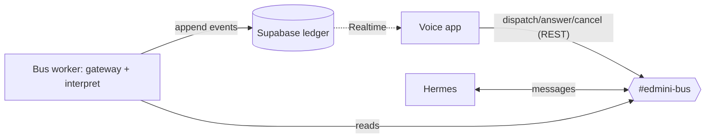

# edmini — Development Journal

> A working journal for **edmini**, a voice agent that supervises autonomous executors. It is a
> **pragmatic, detail-first capture** of what changed, why, the decisions + alternatives, and how
> things were verified — including file paths, code snippets, commands, results, and small diagrams.
> Neutral tone; detail over style, so the content can be repurposed later (blog/book/etc.) rather
> than pre-styled here. Entries are dated, newest first. (Style updated 2026-06-19 from the earlier
> "narrative/publication" framing; those older entries are archived verbatim in
> [`docs/journal-archive.md`](docs/journal-archive.md). Mechanical file-change logs: `docs/SESSION_SUMMARIES.md`.)

## Project overview

edmini is a voice-first *supervisor*: it has no task-execution capabilities of its own and instead
coordinates an external agent harness (initially Hermes) on the user's behalf. Its hard problem is
**attention accounting** — protecting a single human's single-stream voice attention across many
asynchronous agent runs, letting the person decide what is *important* while the system computes
only what is *relevant*, and maintaining a complete, accountable record so that no result the user
produced ever silently disappears.

## Journal Entries

### 2026-06-19 — Run correlation fixed + outbound bus API (oys, fw5 pt1)

- **oys (run correlation):** `discord-transport.dispatch()` now creates a Discord PUBLIC_THREAD per
  task and posts the instruction into it; `runId` = thread id. Experiment confirmed Hermes replies
  *inside* an edmini-created thread (`9 × 9 = 81` in-thread, 6s). E2E smoke: dispatch +
  `harness/discord_message` + interpreted `harness/run_output` all under one `runId`. Commit `4143dfd`.
- **fw5 pt1 — outbound API:** `src/app/api/bus/route.ts` — `POST /api/bus {action: dispatch|answer|
  cancel}` → Discord transport + ledger log (returns `runId` on dispatch). 4 route tests (mocked
  transport+ledger). Commit `ab5f3c4`.
- Verification: tsc clean, 60 unit tests, `next build` passes.

**Next (fw5 pt2 — the v1 capstone):** rewire `VoiceAgent.tsx` Realtime tools → `/api/bus` + track
`activeRunId`; inbound "Narrate" via Supabase Realtime (browser) injecting active-run ledger events
into the live session; then a manual voice test.

---

### 2026-06-19 — Bus build: ledger client, transport, interpreter, worker (yak/n12/dze/2y7)

Built and live-verified the v1 data path (voice app/worker ⇄ Discord bus ⇄ Hermes, Supabase ledger
as system of record). Inbound half complete.

**What changed**
- `src/lib/ledger-supabase.ts` (yak): `createLedger(client)` + `ledgerFromEnv()` — append/snapshot/
  subscribe over the pure core in `src/lib/ledger.ts`. Commit `a935e2d`.
- `src/lib/bus/transport.ts` + `discord-transport.ts` (n12): `BusTransport` (dispatch/answer/cancel)
  + Discord REST outbound as the edmini bot. Commit `c68d25d`.
- `src/lib/bus/interpret.ts` (dze): marker-deterministic + LLM-fallback classifier. Commit `2367a24`.
- `worker/index.ts` (2y7): always-on discord.js gateway → interpret → ledger. `pnpm worker`. `42c5547`.
- deps: `@supabase/supabase-js` 2.108.2, `discord.js` 14.26.4; pnpm pinned 9.15.9 via corepack (4sw).

**Decisions**
- Interpreter is marker-first (Hermes emoji taxonomy), LLM only for plain text. Heartbeats (⏳) → `ignore`.
- The worker is the single ledger tap (logs ALL crossings incl. edmini's own); the transport only
  posts. Matches §0 (every happening → a ledger event).
- `serviceRole` key server-side (worker/API), anon for browser subscribe.

**Diagram + interpreter markers**

`❓`→run_blocked · `⏳`→ignore · `⚠️`/shutdown→run_failed · `online —`→run_started · plain→LLM (default run_output).

**Verification**
- tsc clean; 56 unit tests (envelope, ledger, ledger-supabase, transport, interpret).
- Live: ledger append/snapshot/projectRuns vs real DB; transport dispatch → real Discord message;
  worker E2E → dispatched "what is 6×7?", Hermes replied "42", worker interpreted `run_output`,
  ledger rows confirmed (`harness/discord_message` + `harness/run_output`).

**Gotchas**
- Discord requires a `DiscordBot (...)` User-Agent or Cloudflare returns 403/1010.
- pnpm 8-on-PATH vs lockfile-9/store-10 → corepack `pnpm@9` (`packageManager` pinned).
- `SUPABASE_DB_URL` lives in `infra/supabase/project.env` (not `.env.local`) — empty var made psql hit local PG.
- Run-correlation: Hermes replies under its own message id, not threaded from the dispatch, so a reply
  isn't linked to its task (dispatch `…023…` vs reply `…057…`). Filed `edmini-oys`.

**Open / next**
- `edmini-oys`: run-correlation (likely edmini-creates-thread, or single-active-run + time).
- `edmini-fw5`: voice rewire (lean 3-phase, one active run) — consumes the ledger feed.

> _Earlier narrative-style entries (2026-06-17 → 2026-06-19 "the bus that wouldn't talk") were
> archived verbatim to [`docs/journal-archive.md`](docs/journal-archive.md) on 2026-06-19, when the
> journal switched to the pragmatic style._

