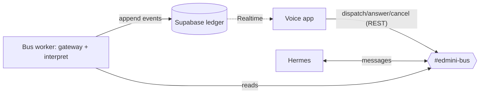

# edmini — Development Journal

> A working journal for **edmini**, a voice agent that supervises autonomous executors. It is
> **rich raw material to tell stories from later — not the finished blog post.** Capture the
> specifics: real decisions + reasoning, alternatives, dead ends, surprises, and concrete changes
> (file paths, code snippets, commands, results, diagrams), plus **direct quotes of pivotal dialog**.
> Detail over brevity (don't over-condense); narrative is welcome when it describes something
> specific. Entries dated, newest first. (Style refined 2026-06-19; earlier narrative entries
> archived verbatim in [`docs/journal-archive.md`](docs/journal-archive.md). File-change logs:
> `docs/SESSION_SUMMARIES.md`.)

## Project overview

edmini is a voice-first *supervisor*: it has no task-execution capabilities of its own and instead
coordinates an external agent harness (initially Hermes) on the user's behalf. Its hard problem is
**attention accounting** — protecting a single human's single-stream voice attention across many
asynchronous agent runs, letting the person decide what is *important* while the system computes
only what is *relevant*, and maintaining a complete, accountable record so that no result the user
produced ever silently disappears.

## Journal Entries

### 2026-06-19 — fw5 pt2 shipped, then a design it forced us to undo (voice rewire → concurrent narration)

Two-part day. First, **fw5 pt2** — the v1 voice capstone — landed (`fcaf456`): `/api/session` tools
swapped from `classify_and_route`/`cancel_pending_action` to `delegate_task`/`answer_run`/`cancel_run`;
`VoiceAgent.tsx` `dispatchToolCall` now POSTs `/api/bus` and tracks a single `activeRunId`; the browser
subscribes to the ledger via `ledgerFromEnv().subscribe()` and narrates `run_blocked/output/failed/done`
for the active run into the live Realtime session (`conversation.item.create` user-msg + `response.create`).
tsc clean, 60/60 tests, build passes. Closed + `needs-verification` (live mic test outstanding).

Then the review turned into the real work of the day — two corrections from the user, both load-bearing.

**1. "Hermes is single-task" was an overstatement I'd inherited, not verified.** Asked to justify it, I
traced it to one observation during `pmo` fixture capture: a `❓ clarify:` *holds the Hermes session*, so
rapid follow-ups came back `⏳ Still working…`. The journal archive even calls it "a second, accidental
finding." The defensible claim is narrower — *a blocked run holds the session* (observed) — not *Hermes
can only ever run one task* (untested inference). The "~6–60s replies" I'd quoted was also a guess; the
only timing fact is the ~3-min `⏳` heartbeat. Lesson logged: don't carry forward an inherited inference as
fact across sessions.

**2. The whole "one active run" rationale was a conflation.** I'd justified the single-run cap as following
from "voice is serial → attention accounting" (design doc §1/§2). The user:

> "voice is serial" means that the conversation between edmini and the user is technically single
> threaded ALTHOUGH more than one topics/tasks/thread may be referenced in a single sentence or
> paragraph. That said, there is no such limitation between edmini and the executor(s)

That untangles three things I'd run together: **input** (one utterance can *reference* many runs),
**output** (edmini speaks one thing at a time — the *only* real serial constraint), and **edmini↔executor**
(bus/API calls, fully concurrent — no seriality at all). Seriality constrains output **multiplexing**, not
run **cardinality**. What voice *actually* forces is a *narration-scheduling* problem — when many runs
contend for one output channel, what do you say and when? One-active-run didn't honor the medium; it
**dodged that scheduler** by making it trivial. A scope cut dressed as a property of voice. And the cap
lived entirely in the voice client — the backend (ledger keyed by `runId`, a Discord thread per task, the
worker) was concurrent all along. Our fw5 implementation was even stricter than the doc: §6 says non-active
runs sit "unread," but `handleLedgerEvent` *silently ignores* them.

**Decision (user picked "Full concurrent narration"):** supervise N runs; narrate all by priority.
Brainstormed the two forks that actually shape the code:
- **Addressing → human-friendly labels.** The model assigns a short label per task (`"export"`,
  `"research"`) and reuses it; `delegate_task/answer_run/cancel_run` take `label`; raw `runId` snowflakes
  stay internal and are never spoken. Client de-dups label collisions and returns the canonical one.
- **Narration → priority + never interrupt the user.** `run_blocked/run_failed` high, `run_output/run_done`
  low; a client-side queue drains one batch at a time only when idle (channel open ∧ user not speaking ∧ no
  response in flight), batching near-simultaneous items ("Two things — the export failed, and research is
  asking about Q3").

Two foresight notes from the user folded in at near-zero cost:
- *"persist the registry in a db ... in the future redis(?)"* — made nearly free by writing the `label` into
  the existing `task_dispatch` ledger payload. The registry becomes a **cache/projection** over the ledger
  (same as the SQL `runs` view over `events`); rehydrate-on-reload becomes a query, not new storage. Persist
  the write now, defer the read.
- *"the 'invoker' role ... an agent or app or api or webhook that can send events to edmini, e.g. email,
  IOT"* — an invoker event is inbound but **run-less** (no label, no registry entry). Keep
  `narration-queue` **source-agnostic** so it slots in later as a second producer. Don't widen the ledger
  `source` enum (`user|edmini|harness`) yet — additive migration when actually built.

Spec written + approved: `docs/superpowers/specs/2026-06-19-concurrent-run-narration-design.md`
(`edmini-9ex`, under epic `edmini-orm`). New pure modules `src/lib/voice/run-registry.ts` +
`narration-queue.ts` (mirroring the `ledger.ts`/`ledger-supabase.ts` pure-core/binding split), then
rewire `VoiceAgent.tsx` and add `label` to `/api/bus` dispatch + `/api/session` tools. Implementation
plan next.

**Angles worth publishing.** *The justification that wasn't* — shipping a feature, then having the user
prove its stated rationale was a category error ("serial channel" ≠ "one task"). *Where a constraint
actually lives* — the single-run limit was 100% client-side over an already-concurrent backend; the
medium was blamed for a scope cut. *The ledger pays for foresight* — "persist it" and "leave room for
invokers" both cost ~nothing because there's already one append-only source of truth.

---

### 2026-06-19 — Run correlation fixed + outbound bus API (oys, fw5 pt1)

- **oys (run correlation):** `discord-transport.dispatch()` now creates a Discord PUBLIC_THREAD per
  task and posts the instruction into it; `runId` = thread id. Experiment confirmed Hermes replies
  *inside* an edmini-created thread (`9 × 9 = 81` in-thread, 6s). E2E smoke: dispatch +
  `harness/discord_message` + interpreted `harness/run_output` all under one `runId`. Commit `4143dfd`.
- **fw5 pt1 — outbound API:** `src/app/api/bus/route.ts` — `POST /api/bus {action: dispatch|answer|
  cancel}` → Discord transport + ledger log (returns `runId` on dispatch). 4 route tests (mocked
  transport+ledger). Commit `ab5f3c4`.
- Verification: tsc clean, 60 unit tests, `next build` passes.

**Next (fw5 pt2 — the v1 capstone):** rewire `VoiceAgent.tsx` Realtime tools → `/api/bus` + track
`activeRunId`; inbound "Narrate" via Supabase Realtime (browser) injecting active-run ledger events
into the live session; then a manual voice test.

---

### 2026-06-19 — Bus build: ledger client, transport, interpreter, worker (yak/n12/dze/2y7)

Built and live-verified the v1 data path (voice app/worker ⇄ Discord bus ⇄ Hermes, Supabase ledger
as system of record). Inbound half complete.

**What changed**
- `src/lib/ledger-supabase.ts` (yak): `createLedger(client)` + `ledgerFromEnv()` — append/snapshot/
  subscribe over the pure core in `src/lib/ledger.ts`. Commit `a935e2d`.
- `src/lib/bus/transport.ts` + `discord-transport.ts` (n12): `BusTransport` (dispatch/answer/cancel)
  + Discord REST outbound as the edmini bot. Commit `c68d25d`.
- `src/lib/bus/interpret.ts` (dze): marker-deterministic + LLM-fallback classifier. Commit `2367a24`.
- `worker/index.ts` (2y7): always-on discord.js gateway → interpret → ledger. `pnpm worker`. `42c5547`.
- deps: `@supabase/supabase-js` 2.108.2, `discord.js` 14.26.4; pnpm pinned 9.15.9 via corepack (4sw).

**Decisions**
- Interpreter is marker-first (Hermes emoji taxonomy), LLM only for plain text. Heartbeats (⏳) → `ignore`.
- The worker is the single ledger tap (logs ALL crossings incl. edmini's own); the transport only
  posts. Matches §0 (every happening → a ledger event).
- `serviceRole` key server-side (worker/API), anon for browser subscribe.

**Diagram + interpreter markers**

`❓`→run_blocked · `⏳`→ignore · `⚠️`/shutdown→run_failed · `online —`→run_started · plain→LLM (default run_output).

**Verification**
- tsc clean; 56 unit tests (envelope, ledger, ledger-supabase, transport, interpret).
- Live: ledger append/snapshot/projectRuns vs real DB; transport dispatch → real Discord message;
  worker E2E → dispatched "what is 6×7?", Hermes replied "42", worker interpreted `run_output`,
  ledger rows confirmed (`harness/discord_message` + `harness/run_output`).

**Gotchas**
- Discord requires a `DiscordBot (...)` User-Agent or Cloudflare returns 403/1010.
- pnpm 8-on-PATH vs lockfile-9/store-10 → corepack `pnpm@9` (`packageManager` pinned).
- `SUPABASE_DB_URL` lives in `infra/supabase/project.env` (not `.env.local`) — empty var made psql hit local PG.
- Run-correlation: Hermes replies under its own message id, not threaded from the dispatch, so a reply
  isn't linked to its task (dispatch `…023…` vs reply `…057…`). Filed `edmini-oys`.

**Open / next**
- `edmini-oys`: run-correlation (likely edmini-creates-thread, or single-active-run + time).
- `edmini-fw5`: voice rewire (lean 3-phase, one active run) — consumes the ledger feed.

> _Earlier narrative-style entries (2026-06-17 → 2026-06-19 "the bus that wouldn't talk") were
> archived verbatim to [`docs/journal-archive.md`](docs/journal-archive.md) on 2026-06-19, when the
> journal switched to the pragmatic style._

