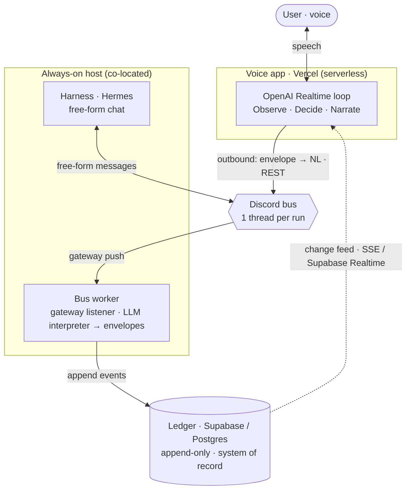

# edmini — Development Journal

> A working journal for **edmini**, a conversational voice agent that supervises autonomous
> executors. It is written as **narrative source material** for longer-form pieces — articles for
> *Towards Data Science* and *Towards AI*, and, where the ideas warrant it, scientific write-ups —
> so it favours argument and rationale over changelogs. Entries are dated, newest first, and meant
> to be quotable more or less as written. (Mechanical file-change logs live in
> `docs/SESSION_SUMMARIES.md`; standalone story beats in `docs/SESSION_STORIES.md`.)

## Project overview

edmini is a voice-first *supervisor*: it has no task-execution capabilities of its own and instead
coordinates an external agent harness (initially Hermes) on the user's behalf. Its hard problem is
**attention accounting** — protecting a single human's single-stream voice attention across many
asynchronous agent runs, letting the person decide what is *important* while the system computes
only what is *relevant*, and maintaining a complete, accountable record so that no result the user
produced ever silently disappears.

## Journal Entries

### 2026-06-17 — From an ambitious specification to a shippable voice layer

*How a sprawling "attention-accounting" architecture was cut down to one defensible first version —
a voice loop, a chat bus, and an append-only ledger — and the single abstraction that made the cut
coherent.*

The session began with a contradiction. On paper, edmini already had a mature v3 architecture: two
domains behind a narrow interface, a principled split between an append-only *accountability ledger*
and a lossy *recall* layer, and a governing slogan — *importance is configured by the user,
relevance is computed by the system*. The code told the opposite story. The supervisor module ran
web searches and sent messages itself through a hardcoded capability switch; edmini, designed as a
pure coordinator, had been built as an executor. The honest reading was that "designing v3" was
really the task of choosing the smallest first version that proves the thesis, and deleting the
prototype's contradictions. What survived the audit was the genuinely hard, genuinely reusable
part: the real-time voice loop, the event log that could seed a ledger, and the session plumbing.

From there the design proceeded as a sequence of deliberate narrowings. The first was the
**substrate**. edmini needs something to supervise, and rather than invent a coordination protocol
we chose an ordinary chat surface — Discord — as the bus between edmini and the harness. The
argument for it is partly aesthetic and partly practical: a chat channel is *visible*, so a
demonstration can show the supervisor at work, and it is *interferable*, so the human can step in by
hand. A short research pass surfaced the load-bearing caveat. Of the seven interactions edmini needs
with an executor — dispatch, observe-started, observe-blocked, answer, observe-result, observe-done,
cancel — five map cleanly onto chat messages and threads, but two do not: a "blocked, waiting on
you" state has no native representation, and cancellation is awkward because a stop message queues
behind the turn already running. Naming those two as the only hard cases is what made the rest of
the design feel safe.

The second narrowing was **scope**. The written v3 already contained a "v1" proposal, but it was not
lean — it shipped a bespoke visual companion, a topic graph, and a relevance engine on day one.
Pressing on it produced a smaller target we called *thin relay + protocol spine*: a voice loop, a
transport to the harness, a normalised event contract, and an authoritative ledger, with exactly one
active run at a time so that "relevance" collapses to a single question — *is this the run we are
talking about?* The companion screen fell away once we noticed that the Discord channel is itself a
visible surface; the speculative attention machinery fell away because it is the part most likely to
be wrong before real traffic exists, and the ledger keeps everything, so none of it is hard to add
later.

The third narrowing was forced by infrastructure. The voice app is happiest on serverless hosting,
but a serverless function cannot hold the persistent connection required to *receive* events from a
chat gateway, even though it can happily *send* over REST. That asymmetry split the system into two
planes: a serverless voice plane that only ever talks outward, and a small always-on worker —
co-located with the harness — that owns the inbound gateway and writes everything it sees into the
ledger. The user's instruction here was blunt and correct: an always-on worker, not polling.

The decisive moment was an abstraction the user articulated better than the spec had. Asked how the
worker should read the harness's messages, the choice was to interpret *free-form natural language*
with a model rather than demand a rigid machine format. The justification reframed the whole
transport layer: a chat bus is the place for the *human, free-form* regime — where edmini, the
harness, and the person all converse in language, and edmini reads it the way a good executive
assistant reads a colleague — whereas anything that genuinely needs *structured* machine exchange
does not belong bolted onto chat at all; that is what a proper agent-to-agent protocol, a direct
API, or an on-device CLI is for. The consequence is clean: the normalised event vocabulary becomes
edmini's *internal* contract, and the transport that produces it is swappable. v1 ships exactly one
transport — Discord, free-form, model-interpreted — and the more structured transports become
future implementations behind the same contract, which keeps the original promise of being
executor-agnostic without paying for it now.

The remaining choices were quieter. The datastore is Supabase: an append-only event table is
textbook Postgres, `pgvector` waits in the same system for the eventual recall layer, and Supabase's
realtime feed is a candidate to replace the hand-rolled change stream. Graph storage was explicitly
not allowed to drive the decision — it is deferred, and when it matters it can be derived from the
flat ledger. The user raised an interesting secondary criterion, that the stack be "CV-worthy," and
the reframe was worth recording: the résumé signal in this project is the *architecture* — an
event-sourced ledger with projections, a transport abstraction, a voice supervisor built on
attention accounting — not the brand of the database, and reaching for exotic infrastructure to
impress usually reads instead as over-engineering.

What stands at the end of the day is a single design document, an architecture diagram, and a set of
resolved questions whose answers are, more often than not, *not yet* — which is exactly what a clean
first version should look like.

**Open questions going forward.** Whether Supabase's realtime feed can replace the bespoke change
stream; how to handle cancellation against a harness that may have no clean interrupt; where the
interpreter runs and what it costs per message; and how the user names and switches the "active run"
by voice.

**Angles worth publishing.** *"The doc said supervisor, the code said executor"* — what an
architecture audit really looks for. *Chat as a complete control plane for autonomous agents*, and
the two primitives it handles badly. *Transport versus contract*: why the right place to draw the
line between a free-form and a structured regime is the most consequential decision in an
agent-coordination system.

---
