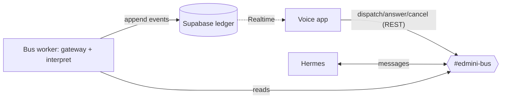

# edmini — Development Journal

> A working journal for **edmini**, a voice agent that supervises autonomous executors. It is a
> **pragmatic, detail-first capture** of what changed, why, the decisions + alternatives, and how
> things were verified — including file paths, code snippets, commands, results, and small diagrams.
> Neutral tone; detail over style, so the content can be repurposed later (blog/book/etc.) rather
> than pre-styled here. Entries are dated, newest first. (Style updated 2026-06-19 from the earlier
> "narrative/publication" framing — older entries below kept as-is. Mechanical file-change logs:
> `docs/SESSION_SUMMARIES.md`.)

## Project overview

edmini is a voice-first *supervisor*: it has no task-execution capabilities of its own and instead
coordinates an external agent harness (initially Hermes) on the user's behalf. Its hard problem is
**attention accounting** — protecting a single human's single-stream voice attention across many
asynchronous agent runs, letting the person decide what is *important* while the system computes
only what is *relevant*, and maintaining a complete, accountable record so that no result the user
produced ever silently disappears.

## Journal Entries

### 2026-06-19 — Run correlation fixed + outbound bus API (oys, fw5 pt1)

- **oys (run correlation):** `discord-transport.dispatch()` now creates a Discord PUBLIC_THREAD per
  task and posts the instruction into it; `runId` = thread id. Experiment confirmed Hermes replies
  *inside* an edmini-created thread (`9 × 9 = 81` in-thread, 6s). E2E smoke: dispatch +
  `harness/discord_message` + interpreted `harness/run_output` all under one `runId`. Commit `4143dfd`.
- **fw5 pt1 — outbound API:** `src/app/api/bus/route.ts` — `POST /api/bus {action: dispatch|answer|
  cancel}` → Discord transport + ledger log (returns `runId` on dispatch). 4 route tests (mocked
  transport+ledger). Commit `ab5f3c4`.
- Verification: tsc clean, 60 unit tests, `next build` passes.

**Next (fw5 pt2 — the v1 capstone):** rewire `VoiceAgent.tsx` Realtime tools → `/api/bus` + track
`activeRunId`; inbound "Narrate" via Supabase Realtime (browser) injecting active-run ledger events
into the live session; then a manual voice test.

---

### 2026-06-19 — Bus build: ledger client, transport, interpreter, worker (yak/n12/dze/2y7)

Built and live-verified the v1 data path (voice app/worker ⇄ Discord bus ⇄ Hermes, Supabase ledger
as system of record). Inbound half complete.

**What changed**
- `src/lib/ledger-supabase.ts` (yak): `createLedger(client)` + `ledgerFromEnv()` — append/snapshot/
  subscribe over the pure core in `src/lib/ledger.ts`. Commit `a935e2d`.
- `src/lib/bus/transport.ts` + `discord-transport.ts` (n12): `BusTransport` (dispatch/answer/cancel)
  + Discord REST outbound as the edmini bot. Commit `c68d25d`.
- `src/lib/bus/interpret.ts` (dze): marker-deterministic + LLM-fallback classifier. Commit `2367a24`.
- `worker/index.ts` (2y7): always-on discord.js gateway → interpret → ledger. `pnpm worker`. `42c5547`.
- deps: `@supabase/supabase-js` 2.108.2, `discord.js` 14.26.4; pnpm pinned 9.15.9 via corepack (4sw).

**Decisions**
- Interpreter is marker-first (Hermes emoji taxonomy), LLM only for plain text. Heartbeats (⏳) → `ignore`.
- The worker is the single ledger tap (logs ALL crossings incl. edmini's own); the transport only
  posts. Matches §0 (every happening → a ledger event).
- `serviceRole` key server-side (worker/API), anon for browser subscribe.

**Diagram + interpreter markers**

`❓`→run_blocked · `⏳`→ignore · `⚠️`/shutdown→run_failed · `online —`→run_started · plain→LLM (default run_output).

**Verification**
- tsc clean; 56 unit tests (envelope, ledger, ledger-supabase, transport, interpret).
- Live: ledger append/snapshot/projectRuns vs real DB; transport dispatch → real Discord message;
  worker E2E → dispatched "what is 6×7?", Hermes replied "42", worker interpreted `run_output`,
  ledger rows confirmed (`harness/discord_message` + `harness/run_output`).

**Gotchas**
- Discord requires a `DiscordBot (...)` User-Agent or Cloudflare returns 403/1010.
- pnpm 8-on-PATH vs lockfile-9/store-10 → corepack `pnpm@9` (`packageManager` pinned).
- `SUPABASE_DB_URL` lives in `infra/supabase/project.env` (not `.env.local`) — empty var made psql hit local PG.
- Run-correlation: Hermes replies under its own message id, not threaded from the dispatch, so a reply
  isn't linked to its task (dispatch `…023…` vs reply `…057…`). Filed `edmini-oys`.

**Open / next**
- `edmini-oys`: run-correlation (likely edmini-creates-thread, or single-active-run + time).
- `edmini-fw5`: voice rewire (lean 3-phase, one active run) — consumes the ledger feed.

---

### 2026-06-19 — The bus that wouldn't talk: three gates and a marker taxonomy

*The ledger and the Discord bus were both "provisioned" and green — yet Hermes answered every
message with a ✓ reaction and nothing else. Three stacked authorization gates, none where the
docs implied, stood between a passing checklist and a bus that actually worked.*

The day began by refusing to trust the green checkmarks. Both halves of the infra were "up," so the
real question was whether they *worked*. Two agents went out in parallel. One took `4sw` — the pnpm
drift (lockfile 9, a pnpm-8 on PATH, a pnpm-9 store) — and resolved it cleanly by pinning
`pnpm@9.15.9` through corepack and adding `@supabase/supabase-js`, which also unblocks the ledger
client. The other took `pmo`: prove Hermes reads the bus.

It didn't. Posting to `#edmini-bus` produced a ✓ reaction and no reply — the most ambiguous failure
there is, because the ✓ proves the message was *seen*. The answer wasn't in any doc; it was in
Hermes's own source and gateway log, and it came in three layers. First, `config.yaml` had
`free_response_channels: ''` and `require_mention: true`, and for channel routing **config.yaml
overrides the env vars** our `configure.sh` had set — so non-mention messages were dropped. Second,
`DISCORD_ALLOW_BOTS=true` is silently invalid: the code checks membership in `{'mentions','all'}`, so
`'true'` never authorizes a bot sender. Third — and this is the trap — *user* authorization is
**env-gated** (`os.getenv('DISCORD_ALLOW_ALL_USERS')`), the exact opposite precedence from the first
gate. Setting it in `config.yaml` (the natural symmetry) did nothing. The log line
`Unauthorized user: … (George V) on discord` was the thread that unravelled it.

The lesson worth keeping: in a system like Hermes, config-vs-env precedence is **per-setting and
undocumented**. Channel routing trusts the file; authorization trusts the environment. The only
reliable way through was reading `gateway/run.py` and tailing `gateway.log` — not the docs, not
assumptions. Every fix was then baked into `configure.sh` so the next `up.sh` gets it right.

Once it talked, the payoff was a gift for the interpreter. Hermes's free-form replies aren't truly
unstructured: they carry **emoji markers** — `❓ clarify:` for a question it needs answered,
`⏳ Still working…` as a ~3-minute heartbeat, `⚠️` for interruption, plain prose for a result. That
turns the inbound interpreter (`dze`) from a pure-LLM classifier into **marker-deterministic with an
LLM fallback** for plain text — cheaper and more reliable. A second, accidental finding: Hermes is
single-task — a blocked clarify *holds the session*, so rapid follow-ups got "still working." That
independently validates edmini's "one active run at a time" design. We verified the production path
too (the edmini *bot* driving Hermes, not just a human), captured the fixtures, and closed `pmo`.

**Open questions.** The ledger client (`yak`) needs the Supabase anon/service keys and an RLS stance
for single-user v1 — does the browser subscribe with anon under permissive RLS, or do we keep RLS
off for now? Will Realtime deliver inserts to the voice app as cleanly as the psql/API checks
suggest?

**Angles worth publishing.** *"The ✓ that meant no"* — debugging an opaque agent harness through its
own source and logs. *Precedence is a lie* — when half your settings trust the file and half trust
the environment. *Free-form, but not unstructured* — keying an interpreter off an agent's emoji
markers before reaching for the LLM.

---

### 2026-06-18 — Where the scripts meet the platforms

*A clean set of provisioning scripts met five different platform realities in one night. What
survived contact — and why "it passes `bash -n`" tells you almost nothing — is the story.*

The day started in code and ended in dirt. Two pieces of groundwork went in first. The
**foundations**: a dependency-free envelope contract (`src/lib/bus/envelope.ts`) — edmini's internal
event vocabulary, deliberately decoupled from whatever transport carries it — and the pure heart of
the **ledger** (`src/lib/ledger.ts`): event/row types, mapping, and a `projectRuns` projection that
mirrors the SQL `runs` view, all unit-tested without a database. Then the **cleanup**: deleting the
hackathon executor (`execute.ts`, the Tavily/Telegram capability switch) so edmini finally *is* what
the thesis says it is — a supervisor that delegates, not an agent that does. That took the test suite
from 26-pass/8-fail to 37 green and the build clean.

The larger goal for the night was *reproducible infrastructure*: one command to stand up the Hermes
bus and the Supabase ledger, grounded in the **real** Hermes v0.14.0 CLI rather than a guessed one
(inspecting `~/.hermes` revealed the actual knobs — `DISCORD_ALLOW_BOTS`, `DISCORD_HOME_CHANNEL_NAME`,
the launchd gateway). Two product decisions shaped it: minimize the irreducible manual steps, and make
**1Password the source of truth** for the secrets the human must supply — `project.env` holds only
`op://` references, resolved at runtime via `op read`, so no token ever lands raw on disk.

Then we ran it, and reality arrived in five acts. **One:** Discord bots *cannot create servers* — the
API returns `code 20001 "Bots cannot use this endpoint"`, flatly contradicting the research that had
confidently said a bot in <10 guilds could. The whole "auto-create a dedicated guild" design was
wrong; it became "you make one server, the script auto-detects the one both bots share and creates the
channel there." **Two:** my `curl -f` had been swallowing Discord's JSON error body, so the failure
was opaque ("curl 56") until I dropped it and the real `20001` surfaced. **Three:** `op whoami`
returns non-zero under 1Password desktop-app integration even when `op read` works fine — my
sign-in gate was rejecting a perfectly good setup; the fix was to stop gating on `whoami` and let the
actual `op read` be the test. **Four — the sharp one:** `configure.sh` sourced `project.env` directly
instead of through `load_env`, so it wrote the *literal* string `op://Private/edmini-hermes-bot/credential`
into Hermes's `.env` — a 41-character "token" — which is exactly why Hermes got a `401`. The same
1Password reference that resolved fine everywhere else was being written unresolved in the one place
it mattered. **Five:** Supabase's free tier caps at two projects per org (we were at the cap), and the
CLI prints a "Cannot find project ref" warning line that corrupted my JSON parse — both masked by a
stray `2>/dev/null`.

Each of these was invisible to `bash -n`, to syntax review, to reading the code carefully. They only
showed up by running the thing against the live platforms, one prompt and one HTTP call at a time.
That is the entry's real lesson: provisioning scripts are a genre where *looks correct* and *is
correct* are nearly uncorrelated, and the gap is entirely platform behavior you can't see from the
shell.

By the end, the **Discord bus is genuinely live and verified**: both bots in a dedicated server,
`#edmini-bus` created, Hermes configured with the real token and restarted, and `hermes send` landing
messages in the channel. The **Supabase ledger is the one thing still pending — and through no fault
of ours**: midway through, Supabase disabled project creation platform-wide (a real incident). Even
after the status banner cleared, the create API kept returning "disabled," so the ledger waits on
their rollout. Everything is idempotent and the DB password is already persisted, so the resumption
is a single re-run.

**Open questions.** Will the constructed Supabase session-pooler URL connect on first try, or will we
need the dashboard's exact URI (the one caveat we couldn't test while creation was down)? Does Hermes
actually *read* `#edmini-bus` once its gateway finishes channel discovery, and what does its real
free-form chatter look like (the fixtures the interpreter needs)?

**Angles worth publishing.** *"Five ways a correct-looking script is wrong"* — a field guide to
provisioning against real platforms. *When your research is confidently wrong* — the `code 20001`
story and designing for capabilities you verify live, not docs you trust. *Secrets as references, not
values* — the 1Password `op://` pattern, and the subtle bug of writing a reference where a value was
due.

---

### 2026-06-17 — From an ambitious specification to a shippable voice layer

*How a sprawling "attention-accounting" architecture was cut down to one defensible first version —
a voice loop, a chat bus, and an append-only ledger — and the single abstraction that made the cut
coherent.*

The session began with a contradiction. On paper, edmini already had a mature v3 architecture: two
domains behind a narrow interface, a principled split between an append-only *accountability ledger*
and a lossy *recall* layer, and a governing slogan — *importance is configured by the user,
relevance is computed by the system*. The code told the opposite story. The supervisor module ran
web searches and sent messages itself through a hardcoded capability switch; edmini, designed as a
pure coordinator, had been built as an executor. The honest reading was that "designing v3" was
really the task of choosing the smallest first version that proves the thesis, and deleting the
prototype's contradictions. What survived the audit was the genuinely hard, genuinely reusable
part: the real-time voice loop, the event log that could seed a ledger, and the session plumbing.

From there the design proceeded as a sequence of deliberate narrowings. The first was the
**substrate**. edmini needs something to supervise, and rather than invent a coordination protocol
we chose an ordinary chat surface — Discord — as the bus between edmini and the harness. The
argument for it is partly aesthetic and partly practical: a chat channel is *visible*, so a
demonstration can show the supervisor at work, and it is *interferable*, so the human can step in by
hand. A short research pass surfaced the load-bearing caveat. Of the seven interactions edmini needs
with an executor — dispatch, observe-started, observe-blocked, answer, observe-result, observe-done,
cancel — five map cleanly onto chat messages and threads, but two do not: a "blocked, waiting on
you" state has no native representation, and cancellation is awkward because a stop message queues
behind the turn already running. Naming those two as the only hard cases is what made the rest of
the design feel safe.

The second narrowing was **scope**. The written v3 already contained a "v1" proposal, but it was not
lean — it shipped a bespoke visual companion, a topic graph, and a relevance engine on day one.
Pressing on it produced a smaller target we called *thin relay + protocol spine*: a voice loop, a
transport to the harness, a normalised event contract, and an authoritative ledger, with exactly one
active run at a time so that "relevance" collapses to a single question — *is this the run we are
talking about?* The companion screen fell away once we noticed that the Discord channel is itself a
visible surface; the speculative attention machinery fell away because it is the part most likely to
be wrong before real traffic exists, and the ledger keeps everything, so none of it is hard to add
later.

The third narrowing was forced by infrastructure. The voice app is happiest on serverless hosting,
but a serverless function cannot hold the persistent connection required to *receive* events from a
chat gateway, even though it can happily *send* over REST. That asymmetry split the system into two
planes: a serverless voice plane that only ever talks outward, and a small always-on worker —
co-located with the harness — that owns the inbound gateway and writes everything it sees into the
ledger. The user's instruction here was blunt and correct: an always-on worker, not polling.

The decisive moment was an abstraction the user articulated better than the spec had. Asked how the
worker should read the harness's messages, the choice was to interpret *free-form natural language*
with a model rather than demand a rigid machine format. The justification reframed the whole
transport layer: a chat bus is the place for the *human, free-form* regime — where edmini, the
harness, and the person all converse in language, and edmini reads it the way a good executive
assistant reads a colleague — whereas anything that genuinely needs *structured* machine exchange
does not belong bolted onto chat at all; that is what a proper agent-to-agent protocol, a direct
API, or an on-device CLI is for. The consequence is clean: the normalised event vocabulary becomes
edmini's *internal* contract, and the transport that produces it is swappable. v1 ships exactly one
transport — Discord, free-form, model-interpreted — and the more structured transports become
future implementations behind the same contract, which keeps the original promise of being
executor-agnostic without paying for it now.

The remaining choices were quieter. The datastore is Supabase: an append-only event table is
textbook Postgres, `pgvector` waits in the same system for the eventual recall layer, and Supabase's
realtime feed is a candidate to replace the hand-rolled change stream. Graph storage was explicitly
not allowed to drive the decision — it is deferred, and when it matters it can be derived from the
flat ledger. The user raised an interesting secondary criterion, that the stack be "CV-worthy," and
the reframe was worth recording: the résumé signal in this project is the *architecture* — an
event-sourced ledger with projections, a transport abstraction, a voice supervisor built on
attention accounting — not the brand of the database, and reaching for exotic infrastructure to
impress usually reads instead as over-engineering.

What stands at the end of the day is a single design document, an architecture diagram, and a set of
resolved questions whose answers are, more often than not, *not yet* — which is exactly what a clean
first version should look like.

**Open questions going forward.** Whether Supabase's realtime feed can replace the bespoke change
stream; how to handle cancellation against a harness that may have no clean interrupt; where the
interpreter runs and what it costs per message; and how the user names and switches the "active run"
by voice.

**Angles worth publishing.** *"The doc said supervisor, the code said executor"* — what an
architecture audit really looks for. *Chat as a complete control plane for autonomous agents*, and
the two primitives it handles badly. *Transport versus contract*: why the right place to draw the
line between a free-form and a structured regime is the most consequential decision in an
agent-coordination system.

---
