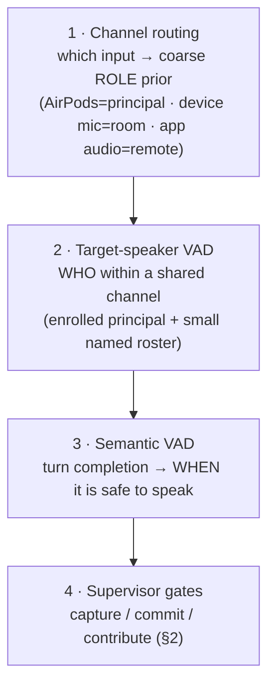

# Conversational Presence — the Input Side of the Supervisor (Architecture Memo)

**Date:** 2026-06-20 · **Status:** framing memo / pre-spec (captures a design conversation; not an approved spec)
**Relates:** [`supervisor-architecture-thesis.md`](./supervisor-architecture-thesis.md) (the output-side thesis) ·
[`open-problems.md`](./open-problems.md) input-addressivity + target-speaker VAD (`edmini-qo3`) ·
[`supervisor-architecture-design-v3.md`](./supervisor-architecture-design-v3.md) §6 (rejected output "modes") ·
channel-agnostic identity (`edmini-shd`) · session memory (`edmini-iee`)

> **Why this memo exists.** The thesis frames edmini as a supervisor that coordinates N agents for one human:
> it decides which *output* reaches the user's single-stream attention. That is one half. This memo names the
> other half: edmini is not *only* a coordinator of agents, it is a **conversational presence** — something the
> user can talk *with* (not only task), and something that can, with permission, be *in* a conversation it is
> not driving. The machinery that makes a good coordinator (turn-taking, when-to-speak, supervisor threading,
> semantic VAD) is the same machinery that makes a good interlocutor and a good guest. This memo is the
> input-side counterpart to attention accounting, and it folds in two capabilities now in flight: **target-speaker
> VAD** and **multiple audio inputs**.

---

## 0. Thesis (one sentence)

The supervisor is not the thing that *runs agents*; it is the thing that **decides who holds the floor and when,
including whether it itself should speak** — and "dispatch an agent" is just the case where the answer is "an
agent." Once you see the supervisor that way, three things that look like separate features (coordinate, discuss,
participate) are one mechanism at three settings of floor control, and the input side of the system gets the same
disciplined treatment the output side already has.

This **inverts the v1 thesis** (as `qo3` already noted): output-side attention accounting computes the relevance
of an output *to the user's attention*; the input side computes the relevance of an input *to edmini's own*
— **was I addressed, should I retain this, should I speak.** A second attention problem, at the other end of the
channel.

---

## 1. The reframe: three modes as a progression of floor control

| Mode | Who is the principal | edmini's control of the floor | Where it lives today |
|---|---|---|---|
| **Coordinate** | edmini (drives, agents execute) | high — edmini is the center | the whole v1/v3 thesis |
| **Discuss** | user + edmini as peers | symmetric dyad | partial (it converses, but framed as task-driver) |
| **Participate** | someone else; edmini is one of N, **not** the principal | low — guest with permission | `qo3` "public" listening, generalized here |

Two honesty notes on novelty:

- **Discuss is close to commodity.** A peer voice dialogue is what every voice-mode product does. Its value here
  is *not* novelty — it is that it falls out of the **same kernel** for free. No project, no task tree, just
  thinking together, using the supervisor's turn-taking rather than a separate code path.
- **Participate is the frontier, and the risky one.** It breaks the assumption every voice assistant is built on:
  that conversation is a strict-alternation dyad in which the assistant is always being addressed. A participant
  has to solve *who is being spoken to*, *when to defer*, and above all *when to stay silent*. The dominant
  failure mode of a participant is not a wrong answer — it is **interjecting at the wrong moment**, which is worse
  than absence. This is a research direction, not a shipped capability, and it should be framed that way
  externally (consistent with the "a voice assistant I've been building since a hackathon, not production" line).

This generalizes `qo3`'s **focused ↔ public** axis. Focused/public is a binary on the *speak* gate; coordinate/
discuss/participate is the fuller progression once you add "edmini is not the principal" and "the room has roles."

---

## 2. The core principle: three independently-gated decisions

Most assistants collapse three decisions into one: you talk to it, **so** it listens, **so** it answers. Edmini's
thesis on the input side is that these are **separate gates**, each with its own trigger, threshold, and cost
asymmetry. The supervisor arbitrates all three.

```
        ┌── CAPTURE (listen / retain) ──┐   ┌── COMMIT (remember) ──┐   ┌── CONTRIBUTE (speak) ──┐
trigger │ audio present on a channel    │   │ relevance to a topic/  │   │ addressed to edmini     │
        │                               │   │ project / memory policy │   │ AND policy permits      │
cost of │ cheap (buffer/transcribe)     │   │ liberal — junk = bloat  │   │ conservative — a wrong  │
error   │                               │   │                         │   │ interjection > silence  │
default │ on (with consent scope)       │   │ per user policy + detail │   │ OFF unless addressed    │
```

Consequences that the rest of the memo leans on:

1. **Relevance → memory is decoupled from addressed → speak.** In ambient operation, the relevance check *feeds
   memory only*; it never licenses spontaneous speech. (This is already the right instinct in the use cases below.)
2. **Memory may be liberal; speech must be conservative.** Two different thresholds over (often) the same signal.
3. The three gates map onto existing machinery: **capture** = the `qo3` ambient buffer + `heard`/`ambient_utterance`
   ledger events; **commit** = recall memory (v3 §7) under a user-set policy; **contribute** = `qo3` addressivity.
   The contribution here is to stop treating them as one decision.

---

## 3. Two axes for *how the participation policy is populated*

The two use cases that motivated this memo sit at opposite ends of one axis: **how much is known before edmini
has to act.**

- **Ambient / inferred (use case 1).** edmini is always listening. On turn/utterance boundaries (not a fixed word
  count — see §4) a cheap pass asks: is this relevant to an active topic/project/memory, and was edmini addressed?
  Relevant content is committed to memory per the user's policy (what to keep, at what level of detail); speech
  stays off unless edmini is addressed, at which point it reconstructs from the rolling buffer (§5) or asks to
  clarify. Policy is **implicit**; topics are **inferred**.
- **Declared / scripted (use case 2).** The user declares an event in advance — *meeting (user+edmini)*,
  *meeting (user+others+edmini)*, *lecture (user+edmini+audience)* — so edmini pre-loads the relevant context, and
  the user states the participation rule up front ("only answer questions addressed to you, never on your own", or
  "when I say *explain XYZ*, take the floor"). Policy is **explicit**; topics are **bounded**.

**The artifact this points to is a declarable participation contract** — a small policy grammar:
`{ when_to_speak, bounded_topics, proactivity_level, who_may_address }`. Use case 2 *states* it; use case 1 is the
**same grammar with a restrictive default and inferred topics**. Naming the grammar once, and populating it two
ways, is the architecture move.

> **⚠️ Keep this off the rejected-modes collision.** v3 §6 rejected `ambient/focused/meeting` *mode machinery* —
> but that was the **output / surfacing** axis (when edmini proactively speaks/notifies, resolved as app
> foreground-vs-background). The participation contract is the **input** axis (does edmini respond to a given
> utterance at all, and may it). `qo3` already flagged the name collision; this memo inherits the warning. A
> "declared event" here is **not** an output surfacing mode; it is an input-side policy with pre-loaded context.

---

## 4. The listening stack: where target-speaker VAD and multiple inputs land

The two capabilities in flight are not bolt-ons — they are the **bottom two layers** of a who/whether/when stack
that makes the addressing problem tractable by *structure* instead of pure semantic inference.



- **Channel as a role prior (multiple inputs).** Distinct audio inputs give a *physical* prior on role, far
  cheaper and more reliable than inferring it from one undifferentiated stream. AirPods = the **principal**
  (high-trust, the user); the iPhone/Mac mic = the **room**; app audio (Zoom etc.) = **remote participants**. In
  the `edmini-shd` model each input is a `voice` **thread** with its own `transport` + `api_identifier`; capturing
  **audio-source + device** on voice events (already the `qo3` forward hook) is the seam. Channel → role is a
  **default prior the participation contract can override** (see app audio below).
- **Target-speaker VAD as identity within a shared channel.** The floor problem is fundamentally about *who*, and
  TS-VAD supplies it: "respond only when the presenter addresses you" and "remember what Alice said" both need a
  voice → identity binding. Per `qo3`, the near-term path is enroll-the-principal TS-VAD (low latency, no
  clustering/cold-start, rejects bystanders), with Speechmatics in a **parallel stream** for true per-speaker
  `from` when needed.
- **Division of labor (important).** On the **AirPods** channel, target ≈ the user almost by construction, so
  TS-VAD earns little there; it earns its keep on the **shared room/app** channel, picking a known voice out of a
  crowd. Enrollment only exists for the principal and a small named roster; the **anonymous audience has no
  enrollment and should not get one** — treat them as undifferentiated room. Do not over-invest TS-VAD in the long
  tail.
- **TS-VAD confidence feeds the gate threshold, not a hard binary.** A false accept on "is the principal
  addressing me" is the expensive-interjection error of §2; uncertainty should bias toward staying silent / a
  light clarify, mirroring v3's confidence-gated fold-in on the output side.

The VAD progression now reads cleanly: **generic VAD** ("someone is talking") → **semantic VAD** ("someone
finished a thought") → **target-speaker VAD** ("*this specific person* is talking").

---

## 5. Input-side memory tiers

The "addressed but I don't have the last few sentences" fallback implies a tier `qo3` only gestures at. Three tiers:

1. **Rolling raw buffer** — *everything heard*, short TTL (seconds–minutes), kept **regardless of relevance**.
   This is what the addressed-path and **decide-later / retroactive promotion** (`qo3`) reconstruct from; without
   it, the speak-gate has nothing to look back at when the user references content the relevance filter discarded.
2. **Working / salient** — relevant to active topics; medium retention.
3. **Committed** — long-term, into recall memory (v3 §7), **per the user's commit policy** (what, and at what
   level of detail).

The clarify fallback should distinguish **"I wasn't retaining that"** from **"I heard it but don't follow"**: an
occasional "sorry, can you repeat?" is a fine guest; a constant one is a bad guest, and the rolling buffer is what
keeps edmini out of the latter. All of this stays consistent with the v3 invariant — **every happening is a
ledger event** — by logging ambient input as a distinct `heard`/`ambient_utterance` event (already the `qo3`
plan), so promotion is a re-interpretation over the ledger, not lost in-memory state.

---

## 6. The lecture/presentation case adds a role hierarchy

c) edmini assisting in a presentation/lecture is *structurally* a sub-case of participate, but it adds something a
peer meeting does not: **a role hierarchy.**

- In a **peer meeting (b)**, participants are roughly equal in their right to address edmini.
- In a **lecture (c)**, there is a **presenter** whose instructions bind edmini, and an **audience** who may
  *trigger* edmini but only under rights the presenter **delegates**. When edmini answers an audience question it
  acts **under the presenter's license**, which the presenter can narrow or revoke mid-event.

This maps onto the participation contract (§3): `who_may_address` is not a flat set but a small authority model
(principal vs delegated). Two further properties make c) the **proving ground**, not a footnote:

- It is the most fluency-demanding case — live, audience-facing, **no private retry** — so it stresses the
  latency-hiding / narration-progress work (`edmini-mb0`) hardest.
- "Presenter says *explain XYZ*" is edmini taking the floor for a semi-autonomous monologue in front of an
  audience: the highest-stakes form of contribute.

---

## 7. Multi-input engineering consequences

The moment there is more than one mic, several things stop being optional:

- **Self-suppression is mandatory.** edmini's own TTS will bleed into the room mic, and the principal's voice will
  bleed across channels. edmini's output must be **subtracted from every input channel** (acoustic echo
  cancellation / known-signal removal) or it will transcribe and react to itself.
- **Cross-channel dedup.** The principal's voice picked up on both AirPods and the device mic must count **once**.
- **Timestamp alignment.** Streams must be co-timestamped off **one monotonic clock** (already budgeted in `qo3`),
  or turn ordering across channels scrambles — and "the user interrupted the speaker" is exactly the reasoning
  that depends on correct ordering.
- **App / Zoom audio is a different animal.** It is a **mixed far-end** stream (multiple remote speakers,
  codec-compressed, often with upstream VAD/noise-suppression already applied). TS-VAD enrollment on far-end
  voices is harder (no clean enrollment audio; the codec distorts speaker characteristics). And **role-wise,
  remote Zoom participants are peers (b), not audience (c)** — so channel does **not** map 1:1 to role, which is
  precisely why the contract overrides the channel prior.

**Sequencing recommendation.** Two physical mics first (**AirPods + device mic**) — this cleanly unlocks use case 1
and the lecture case with minimal new signal-processing risk. **App/Zoom audio second**, because it reopens
enrollment, signal quality, and echo all at once for a use case that is probably secondary.

---

## 8. Consent — channel + TS-VAD turn a policy into a mechanism

Always-on capture of conversations that include **other people** is the genuinely loaded part — legally (two-party
-consent jurisdictions) and socially. The user's commit policy governs the *user's* data; **"who in the room
consented to being retained"** is a separate, first-class question, not a sub-case of "what should I remember."

The two capabilities in this memo make the consent boundary **enforceable** rather than merely stated:

> Retain everything on the **principal (AirPods) channel**; on the **shared room channel**, retain only
> **enrolled / consented** speakers (TS-VAD identity); everyone else stays in the **transient rolling buffer**
> (§5) and **never commits**.

That is the three-tier memory model with an enforcement handle. This is also where the input side touches the
**security / attack-surface** thread (the publishing Post 4 territory): an always-listening, multi-party,
memory-committing surface is an attack and privacy surface, and should be designed as one.

---

## 9. What this does *not* change

- **Output-side attention accounting is untouched.** `notify` as a voice-channel assertiveness directive, the
  surfacing queue, importance-configured / relevance-computed, the ledger ↔ recall split — all hold. This memo is
  the symmetric *input* problem, not a revision of the output one.
- **The invoker role stays distinct.** The future run-less **invoker** inbound role (external senders:
  email/IoT/webhook) is *not* ambient audio. Ambient audio is the user's own near-field speech and the room.
  Both are inbound-but-not-a-run, but they are different sources and should not be conflated.
- **No new system of record.** Ambient capture is more `heard` events on the existing append-only ledger; the
  rolling buffer is a short-TTL working store, not a second ledger.

---

## 10. Phasing — the v0 ladder (committed order)

The rungs form a strict dependency chain: each depends on the one below, and the order is chosen so the cheapest,
highest-value gate ships first.

**The coupling principle that runs through the whole ladder:** the **speak gate** is set deliberately to
*high-confidence, biased to silence*, and that is only affordable because **misses are cheap to recover** — the
rolling buffer + decide-later promotion (§5) turns a false negative into "edmini, that was for you" answered
*from the buffer, without the user re-explaining*. Threshold and recovery-path are designed together; raise one
only as far as the other can catch. (Note: "100% sure" is the *spirit* — the real knob is a high threshold plus
the buffer, never a literal certainty that would collapse into never speaking.)

**Two orthogonal gates, sequenced:** **TS-VAD** answers *is this the enrolled principal vs a bystander*; **intent**
answers *is the principal addressing me vs someone else.* They are AND'd to speak — but TS-VAD alone is the cheap,
reliable half, so it ships first and already removes the largest class of bad interjections (responding to other
people in the room).

- **v0 — TS-VAD / bystander rejection.** Get *some level* of enroll-the-principal target-speaker VAD working on a
  single shared mic; edmini only ever *considers* responding to the enrolled user. This is the `qo3` near-term
  step, and the biggest single win in any non-solo room. Forward hooks already specified: capture **audio-source +
  device** on voice events.
- **v1 — conservative intent gate, made safe by memory.** Add the rule: **do not respond unless confident the
  principal is addressing the assistant** (TS-VAD ∧ intent), biased to silence. Ship the **rolling raw buffer** +
  `heard` ledger events *in the same step*, because the buffer is what makes the conservative gate usable
  (decide-later promotion on "that was for you"). These two are one deliverable, not two.
- **v2 — co-presentation (declared context + presenter authority).** The declared-event path of the participation
  contract (§3) plus the lecture role hierarchy (§6, `who_may_address` = principal vs delegated). Pre-load context;
  presenter binds and can revoke the floor.
- **v3 — third parties address edmini.** Relax the principal-only assumption under the participation contract so
  the audience/peers may trigger edmini within delegated rights. This is the frontier; it earns its way in behind
  the conservative gate, not a demo deadline. (App/Zoom audio, §7, attaches around here.)

> **Honest framing.** v0–v1 are concrete and near-term (they extend `qo3` directly). v2–v3 are the research
> direction: participate done badly is worse than absence, so they ship behind the conservative speak-gate above,
> never ahead of it.

> **Publishing note (not a commitment).** The listening stack (§4) and the three-gate model (§2) are candidate
> **Supervisor Deep-Dive** material, and **target-speaker VAD** specifically is something the usual voice-LLM
> writing does not touch — the "production patterns nobody talks about" register. Reference by capability, per the
> project's conventions, and keep it on the input-attention framing so it reads as engineering, not positioning.

---

## 11. Open questions for the spec phase

1. The participation-contract grammar: exact fields, defaults, and how a declared event pre-loads context.
2. The authority model for `who_may_address` (principal vs delegated; revocation mid-event) — §6.
3. Rolling-buffer scope/TTL and the commit-policy UI (what the user marks keep/drop and at what detail).
4. The race between **commit-liberally** and **consent**: when an un-enrolled voice says something the user later
   wants kept — is it promotable, or is non-consent irreversible? (§5/§8 tension.)
5. Channel→role override rules in the contract (the Zoom-peers-not-audience case, §7).
6. Whether discuss mode needs *any* distinct machinery or is purely the kernel at a symmetric setting.
7. TS-VAD confidence → gate-threshold mapping, shared with the output-side confidence gate (v3 §8) or separate.
