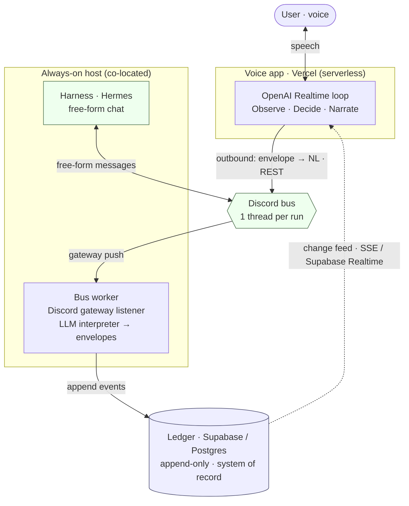

# edmini v1 — Voice Layer over an Agent Harness (Design)

**Status:** draft for review
**Date:** 2026-06-17
**Beads:** epic `edmini-orm` (design task `edmini-1id`)
**Builds on:** [`supervisor-architecture-design-v3.md`](./supervisor-architecture-design-v3.md), [`supervisor-architecture-thesis.md`](./supervisor-architecture-thesis.md), [`supervisor-architecture-analysis.md`](./supervisor-architecture-analysis.md)

This is the concrete v1 build design. It does not restate the v3 thesis; it selects the
smallest slice of v3 that proves the thesis and pins down the decisions v1 must make.

---

## 1. Goal & scope

**v1 is a clean voice supervisor layer over an external agent harness** (Hermes or any
similar executor), with **Discord as the bus**. Scope is locked to **"thin relay + protocol
spine"**:

- the existing OpenAI Realtime **voice loop**,
- a **transport layer** that connects edmini to the harness (v1 transport = Discord),
- a **normalized envelope contract** (edmini's internal event vocabulary), and
- an **authoritative append-only ledger** as the system of record.

**One active run at a time.** Relevance collapses to a one-line "is this the active run?"
check. No topic graph, no relevance engine, no companion visual surface, no snooze, no recall
layer, no escalation recognition. These are deferred, not rejected — the ledger keeps
everything, so they are re-addable without rework.

**edmini does not execute.** It delegates to the harness and stays accountable via the
ledger. The hackathon executor (edmini running Tavily/Telegram itself) is deleted.

---

## 2. The thesis kept

One sentence, carried from the v3 thesis: edmini's job is **attention accounting** — protect
the user's single-stream voice attention, let the user own *importance* while edmini computes
only *relevance* and reacts to *structural facts* (a blocked run), and keep a complete,
accountable record so nothing the user produced silently disappears. v1 honors this with the
ledger and the "one active run" surfacing rule; everything else in v3 is deferred machinery.

---

## 3. Topology

Four parts, one system of record. The split is forced by Vercel: serverless can make
**outbound** REST calls fine, but cannot hold the persistent gateway connection needed to
**receive** Discord events. So a small always-on **bus worker** owns the inbound side.



*Read it as three planes: the **voice plane** (Vercel, serverless, REST-only out), the **bus +
execution plane** (the always-on host running the worker and the harness, the only place that holds
the Discord gateway connection), and the **ledger** (the system of record both planes write
through). Solid arrows are synchronous calls; the dotted arrow is the asynchronous change feed the
voice app subscribes to.*

- **Voice app (Vercel / Next.js).** The voice loop. Reads the ledger change feed for what to
  say; posts outbound envelopes by rendering them to natural language and sending via Discord
  **REST** (serverless-safe).
- **Bus worker (always-on, co-located with the harness).** Owns the Discord **gateway**
  connection. Interprets inbound harness chat into normalized envelopes and appends ledger
  events. **No polling** — gateway push only.
- **Ledger DB (Supabase / Postgres).** Append-only system of record. Replaces the current
  `/tmp` + in-memory stores, which do not survive cold starts. **Supabase Realtime** is a
  candidate to power the ledger change feed the voice app reads, in place of the hand-rolled SSE.
- **Harness (Hermes or similar).** Posts free-form messages to per-run Discord threads. Its
  internals, memory, and self-improvement are out of scope (non-invasive, per v3 §0).

**Discord is the bus, not the ledger.** Persistent ≠ authoritative. Read the channel, but tap
everything into edmini's own append-only ledger; never inherit Discord's retention/ordering as
the accountability guarantee.

**On "no polling."** The rule is about Discord: inbound from the harness is **gateway push**,
never a timer that polls channel history. The voice app reading its own ledger over **SSE** (the
existing event-stream mechanism) is a local change feed, not Discord polling.

---

## 4. The transport layer & the normalized envelope contract

### 4.1 Two regimes, deliberately separated

- **Free-form / human regime → Discord (v1).** edmini, the harness, and the *user* all
  converse in natural language in a shared channel. This is the "executive assistant" surface:
  the user can watch edmini delegate in plain English, watch the harness reply, and barge into
  the channel manually. This visibility and user-interferability is why Discord is the v1 bus.
- **Structured regime → not chat.** If a thing genuinely needs structured machine-to-machine
  exchange, it does **not** belong bolted onto a chat app as rigid JSON. That is when you reach
  for **A2A messaging, a direct API, or a CLI** (CLI if edmini runs on-device). These are
  *alternative transports*, designed for later, not v1.

### 4.2 The contract is internal; the transport is swappable

The **normalized envelope** is edmini's internal event vocabulary, below the transport line:

- **Inbound (harness → edmini):** `run_started`, `run_blocked` (carries the question),
  `run_output` (carries the result), `run_done`, `run_failed`.
- **Outbound (edmini → harness):** `task_dispatch` (instruction), `answer` (unblock),
  `cancel`.

Each envelope carries `run_id`, `seq`, `kind`, `payload`, `ts`. **`run_id` = the Discord
thread snowflake** (free stable identity; resolves v3 §10 #5).

A **transport** produces and consumes this contract. v1 ships exactly one:

- **Discord transport (v1).** *Inbound:* the bus worker runs each harness message through an
  **LLM interpreter** (primary, not a fallback) that classifies free-form chat into the inbound
  envelope kinds. *Outbound:* edmini **renders** `task_dispatch`/`answer`/`cancel` envelopes
  into natural-language Discord messages.
- **A2A / API / CLI transports (future).** Produce the same envelopes directly, no LLM
  interpretation, for the structured regime.

This keeps v3's executor-agnostic promise: swapping the harness or the channel is a transport
change; the ledger, supervisor, and voice layer never move.

### 4.3 The seven interactions over the Discord transport

| Interaction | v1 mapping | Notes |
|---|---|---|
| (a) send task | edmini posts NL instruction in a new run thread | clean |
| (b) run started | harness chats "on it…" → LLM → `run_started` | clean |
| (c) run blocked (asks user) | harness chats a question → LLM → `run_blocked` | clean via interpreter (no native Discord "waiting" state needed) |
| (d) answer / unblock | edmini posts NL answer in the thread | clean |
| (e) run output | harness chats result → LLM → `run_output` | large results as attachments / chunked |
| (f) done / failed | harness chats outcome → LLM → `run_done`/`run_failed` | clean |
| (g) **cancel** | **awkward** | a "stop" chat message queues *behind* the running turn; v1 uses a `/stop` slash-command side channel if the harness supports it, else best-effort NL |

### 4.4 Discord setup gotchas (one-time)

- The worker bot needs the **MESSAGE_CONTENT privileged intent** to read message text.
- Bot frameworks **ignore other bots by default** — the worker must opt in to reading the
  harness bot's messages.
- Rate limits (~50 req/s global) are a non-issue at coordination volume; sort history by
  snowflake ID, not arrival order.

---

## 5. The ledger

Append-only, immutable. Every boundary crossing becomes one event:

```
event: { event_id, ts, run_id, source: user | edmini | harness, kind, payload }
```

- **Run lifecycle and read/unread are projections** over the event stream, never stored mutable
  state. (This dissolves v3/v2's "silent is unread forever" contradiction.)
- **System of record.** Nothing in edmini exists outside the ledger. The harness's own memory
  is treated as *recall* (lossy, not authoritative) and is never the ledger.
- **Datastore: Supabase (Postgres).** Chosen for ease/cost, consolidation with the user's other
  projects, native `pgvector` for the future recall layer (v3 §7), and **Realtime** as the
  ledger change feed (the voice app subscribes to ledger-table changes directly, replacing the
  bespoke SSE fan-out). Graph is deferred (v3 defers graph machinery; relational suffices at
  single-user scale; managed Supabase has no native graph engine, so a derived/dedicated graph
  store comes later, cheaply, off the flat ledger). The existing
  [`src/lib/event-log-store.ts`](../../src/lib/event-log-store.ts) is refactored into the ledger
  writer; the dashboard becomes a thin ledger viewer.

**Accountability in v1, honestly stated.** Because inbound awareness flows through an LLM
interpreter, detection is *eventually-consistent and occasionally imperfect*, not continuous and
exact. The invariant holds in substance: every harness message the worker sees becomes a ledger
event, and nothing reaches the harness without an outbound event landing first. Misclassification
is a recall-quality bug, not a lost-event bug — the raw message is still logged.

---

## 6. The voice layer

Keep the existing OpenAI Realtime loop ([`VoiceAgent.tsx`](../../src/components/VoiceAgent.tsx),
GA session route). The three v3 phases stay simple because v1 has no topic graph or relevance engine:

- **Observe.** A User utterance is a new task or a reference to an existing run (by its label).
  Harness envelopes arrive via the ledger feed (Supabase Realtime) as they land.
- **Decide.** Priority, not a relevance engine: `run_blocked` / `run_failed` are high,
  `run_output` / `run_done` are low.
- **Narrate.** Speak it, one batch at a time, naming the run by its label; gated so it never
  interrupts the User and never fires into an in-flight response.

> **Update (2026-06-19, `edmini-9ex`): N concurrent runs, not one.** v1 first shipped a single
> *active run* (`edmini-fw5`); review showed "voice is serial" constrains only the *output channel*
> (edmini speaks one thing at a time), **not run *cardinality*** — v3 §1 already had this right
> (input is multiplex, the channel serial). So the voice layer now supervises **many concurrent
> runs**, each addressed by a short model-chosen **label** (`delegate_task(instruction, label)` /
> `answer_run(label, …)` / `cancel_run(label, …)`). A client-side **run registry** (label↔runId, a
> cache/projection over the ledger) and a **source-agnostic priority narration queue** replace the
> single `activeRunId`; the queue drains only when the channel is idle and batches near-simultaneous
> updates into one utterance. See [`run-registry.ts`](../../src/lib/voice/run-registry.ts),
> [`narration-queue.ts`](../../src/lib/voice/narration-queue.ts), and the
> [design spec](../superpowers/specs/2026-06-19-concurrent-run-narration-design.md).

---

## 7. What's deleted, what's kept

**Delete.** [`src/supervisor/execute.ts`](../../src/supervisor/execute.ts) (Tavily/Telegram —
edmini does not execute); the capability switch in
[`process-turn.ts`](../../src/supervisor/process-turn.ts); `SEED_THREADS` in
[`thread-manager.ts`](../../src/lib/thread-manager.ts).

**Reassess.** The Workflow SDK (`'use workflow'` / `'use step'`) existed for edmini-as-executor.
v1 delegates execution to the harness, so it likely leaves; the durability concern moves to the
bus worker (a normal long-lived process), not a durable edmini workflow.

**Keep.** The Realtime voice loop and GA session route; the event-log infra (refactored into the
ledger); the SSE/dashboard (becomes a thin ledger viewer).

---

## 8. v3 §10 open decisions, resolved for v1

| # | Decision | v1 resolution |
|---|---|---|
| 1 | run vs job | **run** |
| 2 | Project: entity or tag | **tag on run** (no Project entity in v1) |
| 3 | bulk acknowledgement | **handled by batching** — the narration queue collapses near-simultaneous updates into one utterance (revised under `9ex`; the original "one active run makes it moot" no longer holds) |
| 4 | snooze semantics | **deferred** (not in v1) |
| 5 | output identity / addressing | **Discord thread/message snowflakes** |
| 6 | third-party recall layer | **none in v1** — ledger + LLM context window only |
| 7 | escalation recognition | **deferred** (future) |
| 8 | partial-delivery state | **light** — ledger records delivered/acknowledged; full barge-in offset tracking deferred |

---

## 9. Build defaults & remaining open items

**Decided (2026-06-17):**
- **Change feed: Supabase Realtime** — the voice app subscribes to ledger-table changes directly,
  replacing the bespoke SSE fan-out.
- **v1 executor: a real harness from the start** (not a stub). This puts harness availability and
  integration on the critical path, so the build *leads* with standing up the concrete harness and
  confirming it speaks Discord (see §10, task 0). **Risk:** the concrete "Hermes" was not verifiable
  during research; if it is not readily runnable, reconsider at task 0 (another framework, or a
  temporary stub).

**Build defaults (adopted unless revisited):**
- **Repo layout / hosting:** one repo; bus worker as a `worker/` Node service beside the Next.js
  app; develop locally, deploy the worker to a small always-on host when wiring the harness.
- **Interpreter model:** a small/cheap/fast model for per-message classification; log every
  decision; revisit.
- **Auth:** single-user v1, no user auth; endpoints behind a shared secret. RLS deferred.

**Still open:**
1. Cancellation over the Discord transport: confirm whether the chosen harness exposes a
   `/stop`-style interrupt, else accept best-effort NL cancel.
2. ~~"Active run" switching UX in voice~~ — **resolved (`9ex`):** runs are addressed by explicit
   model-chosen labels; there is no single "active run" to switch.

**Post-v1 open problems** (rough outlines, design later): see
[`open-problems.md`](open-problems.md) — currently **input addressivity** (edmini responding only
when addressed; "focused" vs "public" listening; `edmini-qo3`).

---

## 10. Build order (maps to beads)

Epic `edmini-orm`:

0. **Harness standup** *(new — critical path, "real harness from the start")* — select and run the
   concrete harness, confirm it posts/reads a Discord channel, capture its real message style as
   fixtures for the interpreter.
1. `edmini-1id` — this design doc + resolved decisions *(in progress)*
2. `edmini-yak` — ledger: Supabase/Postgres + append-only schema + projections + Realtime feed
3. `edmini-n12` — normalized envelope contract + Discord transport (outbound NL rendering)
4. `edmini-2y7` — bus worker: always-on gateway listener → ledger
5. `edmini-dze` — inbound LLM interpreter (free-form harness chat → envelopes)
6. `edmini-fw5` — voice layer rewire: lean 3-phase loop, one active run
7. `edmini-4ep` — remove hackathon executor + dead code
