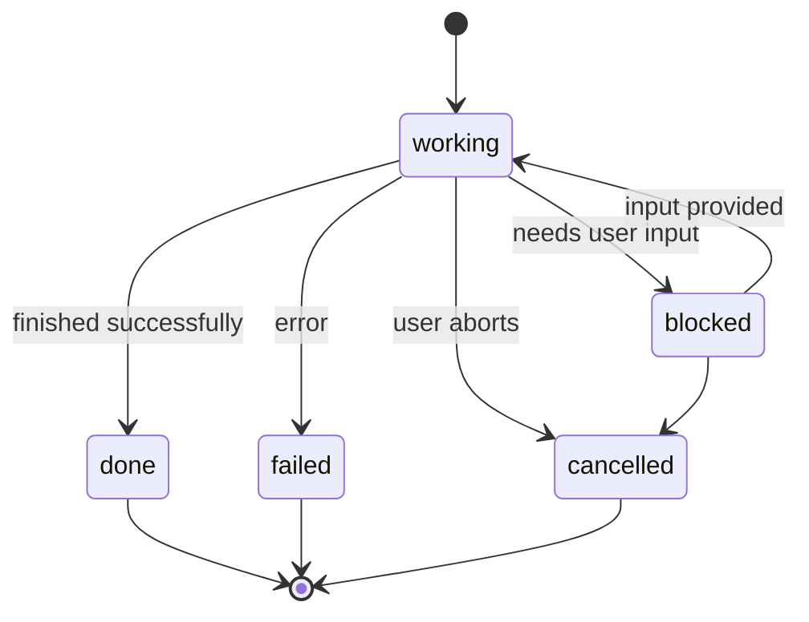
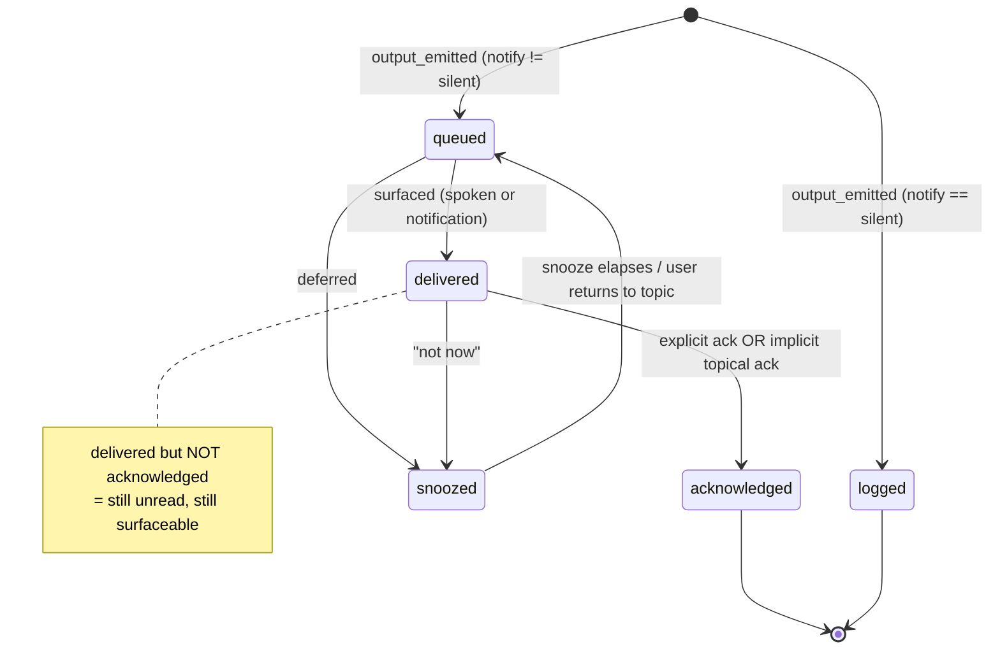

# Supervisor Architecture — Design (v3)

**Status:** draft for review (supersedes the v2 "Thread State Model")
**Date:** 2026-06-09
**Context:** edmini supervisor-side management of voice conversations between one human and N asynchronous executor agents. v3 reframes the problem around two domains and a narrow interface between them. Concrete implementation remains a downstream layered exercise (see §10).

> **v3 note.** v2 put work-tracking and attention-management in a single ontology (project, task, output) feeding a single queue that doubled as an accountability log. That conflation produced contradictions, the sharpest being a `silent` output that was simultaneously queued, unread forever, and polluting badge counts. v3 makes three moves. First, it splits the system into a **Project Manager domain** (work decomposition and tracking) and a **Supervisor domain** (attention management), with a narrow contract between them. Second, it separates the **accountability ledger** (append-only, complete, system of record) from **recall memory** (summarized, lossy, optimized for retrieval). Third, it sharpens v2's anti-scoring principle: the system never computes **importance** (the user's value judgment, configured), but it does compute **relevance** (coherence with the current conversation, a legitimate semantic task). The supervisor's job is then decomposed into three phases: observe, decide, narrate.

---

## 0. Design invariant — accountability (awareness, not exclusivity)

edmini is the supervisor and the layer **accountable** to the user for all the work. The invariant is **awareness, not exclusivity**: edmini must never go blind, and must always be able to account for what happened. The user normally relates to edmini; if they reach into a back-of-house surface directly (for example posting into a bus channel), edmini **detects and incorporates** it rather than preventing it. Prevention is brittle and, on a third-party surface, unenforceable; continuous awareness is the real guarantee.

The execution harness (see §2.1) is itself the largest back-of-house surface. Its own action loop, its memory, and its messaging gateways are exactly where things could happen without edmini seeing them. So **detect and incorporate** becomes concrete: instrument the harness boundary so that everything through it (a run starting, an output emitted, a user message arriving via one of the harness gateways) becomes a ledger event. The bus-channel example above is one specific case of this general requirement.

Awareness is scoped to the boundary, not to the executor's internals. The harness may be arbitrarily complex inside (self-created skills, prompt self-optimization, its own reasoning), and edmini neither gates nor mirrors any of it. It observes only what crosses into the user's attention or what it must answer for, which is the set of boundary events above. Surveilling the executor's cognition is explicitly a non-goal.

In v3 this reduces to a single rule: **every happening becomes a ledger event** (§7). That covers the out-of-band cases directly. The one honesty cost worth stating: detection of external writes is eventually-consistent, not truly continuous, so there is a brief window between an external action and its event. The invariant holds in substance, because nothing reaches an executor, and no executor acts, without a corresponding event landing in the ledger.

---

## 1. Framing

A voice supervisor sits between one human user and N executor agents working asynchronously. Output arrives at unpredictable times and must reach the user through a single serialized channel: speech when the app is in focus, notifications when it is not. The cognitive ceiling on simultaneous voice work is not set by how many workstreams exist. It is set by how often the user's current focus is broken, and by how many produced-but-unacknowledged results the user is mentally tracking. **Focus preservation is therefore the supervisor's optimization target.**

A clarification the rest of the design turns on: single-stream is a property of the voice *channel* and of human listening, not of the user's mind. The user's input is multiplex (one utterance can raise several topics); the channel is serial. The supervisor's core work is to bridge the two, disambiguating multiplex input into overlapping topics and re-serializing to one spoken stream without losing anything.

The design rests on four ideas:

1. **Two domains, one interface.** Work decomposition (what work exists, how it is broken down, what state each piece is in) and attention management (what the user is attending to, when to break focus) are different problems. The Project Manager owns the first, the Supervisor owns the second, and they communicate through a narrow output stream (§2.3).
2. **Importance is configured; relevance is computed.** Whether a result *matters enough to interrupt* is the user's value judgment, expressed as a configured hint, never guessed by the system. Whether a result *connects to what is being discussed now* is a semantic-coherence question the supervisor legitimately computes. These are independent axes and they compose (§5).
3. **Nothing is lost.** Every output lands in a persistent ledger, tagged to its topic, and stays unread until explicitly acknowledged. Focus is preserved by deferring, not by dropping.
4. **Everything leaves a trail.** The ledger is the system of record. `silent` means *recorded but not surfaced*, never *not recorded*. As edmini grows to coordinate sub-agents, inter-agent exchanges become outputs too; most are `silent`, but all are logged, so the supervisor can always reconstruct and answer for the work.

---

## 2. The two domains

### 2.1 Project Manager domain (work tracking, back-of-house) — a tree

The PM decomposes and tracks work. Its ontology is hierarchical:

```
Project 1 --< N Task 1 --< N Run 1 --< N Output
```

- **Project** — a workstream or theme.
- **Task** — the unit the user configures. Carries the `notify` default and a topic binding at creation.
- **Run** — one executor's pass at a task (formerly called "thread" in v2; renamed to free that word for the conversation domain). Task to Run is 1:N to accommodate sub-agents; today it is often 1:1.
- **Output** — a surfaceable item a run emits. Inherits its project and topic from its task by provenance (§9).

Run lifecycle:



`failed` and `cancelled` are distinct from `done` because the supervisor must account for them differently to the user. `blocked` is a structural fact (the executor cannot proceed), not an importance judgment, but it carries back-pressure the others lack: a blocked run is stalling work, which justifies raising surfacing assertiveness one level as policy (§5).

The PM does **not** make surfacing decisions and does **not** touch the conversation.

**Build note: the PM is an adapter over an execution harness, not a from-scratch build.** The work of actually running a task (tool calling, model routing, skills, scheduling, and the messaging transports) is what an agent harness such as Hermes provides, and rebuilding it would be wasted effort. What a harness does not hand you cleanly is the observable surface this domain exists for: a first-class run lifecycle (the diagram above) and the tagged output stream the supervisor consumes (§2.3). So the PM domain is thin. It wraps the harness and surfaces run state and outputs in a form the supervisor can project over and stay accountable to. One thing the harness does not provide at all is the voice channel: harness transports are text and chat (Telegram, Discord, and the like), while the focus-coupled voice surface, the whole reason the supervisor exists (§5), is edmini's to build on top. The adapter is a **minimal observability contract, not a normalization layer**: it extracts the least the supervisor needs (the run lifecycle states that bear on attention, and the outputs) and deliberately does not flatten executors into a uniform facade. Executors may take many shapes; edmini does not mask that variety, it manages the user's attention across it.

**Framing: the PM reads as an inbox over a message bus.** Operationally the PM is not orchestration, it is inbox management. Executors post to a shared message bus; edmini reads it the way a mail assistant reads a mailbox. This is why the PM is not really a domain to build: run state is inferred from the messages on the bus (working, blocked-and-asking, done, failed are message kinds), exactly the projection model of §3, the same way a mail client infers "awaiting reply" without storing a separate state machine. Most of the supervisor's machinery is the email model in other words: read/unread until acknowledged is the unread flag, importance-configured-plus-relevance-computed is VIP senders plus threading, persistent-and-tagged is labels and threads. The one place the analogy stops is delivery: a mailbox is scanned visually at the user's pace, whereas edmini serializes the same inbox into single-stream voice, which is synchronous and interrupts. So the inbox framing simplifies coordination (the part that was already thin) and leaves the attention layer (the real work) untouched.

### 2.2 Supervisor domain (attention management, user-facing) — a graph

The supervisor domain is **many-to-many overlays on a linear spine**, not a hierarchy. Forcing it into a tree would be a mistake.

**Spine:** the message log (user utterances plus supervisor narration), ordered in time.

**Overlays, all M:N:**

- topic to message (a message can touch several topics; a topic spans many messages)
- topic to thread (a thread can involve several topics; a topic can span several threads)
- topic to output (an output is placed onto one or more topics)
- thread to message (messages belong to threads)

Entities:

- **Conversation** — the linear spine. Immutable once recorded. Everything else is structure on top of it.
- **Topic** — a semantic grouping of conversation around a project or theme. Created by user messages or supervisor decision. Not a partition; topics overlap.
- **Thread (conversational)** — a strand the user can pick up, put down, and return to. Distinct from the PM's Run.
- **Meeting** — a bounded, possibly scheduled focus session, optionally with an agenda. Not a separate surfacing mode (§6); a named grouping of topics with optional temporal boundaries.
- **Focus** — internal, not a user-facing entity. The optimization target: the active topic set plus active thread plus the cost of breaking focus right now.
- **Memory** — the recall layer (§7): summarized, searchable context. Not the system of record.

**Decision:** adopt the graph *model* now so the spec does not bake in a tree it later tears out. Defer the graph *machinery* (graph DB, traversal-based relevance, embeddings as edges). Plain relational join tables back it fine at single-user scale. The graph's natural home, when it matures, is the recall layer (§7), derived from the flat ledger.

**Responsibilities.** The supervisor's core job is **attention-flow management**: disambiguate multiplex user input into topics, decide what to surface and when, queue what can wait, escalate what needs different treatment, and keep the interaction coherent while complexity runs in parallel underneath. Two notes on scope:

- **Multiplexing spans the boundary.** Handling parallel user concerns through sequential execution is shared work. The PM tracks which executor handles what (run tracking, §2.1); the supervisor tracks how the user's intents interleave across topics and threads. Executor-tracking is not duplicated into the supervisor.
- **Bidirectional queueing.** Inbound, executor outputs are queued so the user is not overwhelmed (the surfacing queue, §3 and §5). On the input side, the supervisor also sequences the user's own scattered, multi-topic input so they can work through one topic at a time without losing the others.

#### Escalation

Escalation is the load-bearing concept; a meeting is only one of its modes. The supervisor recognizes when a topic cannot be resolved in a couple of conversational turns and needs different treatment, then picks a mode: raise the `notify` level, pull in more context, invoke a specific executor, queue for focused work, or initiate a meeting. The supervisor owns the *recognition* (when, and which mode); the escalation *actions* are separate concerns that can evolve independently. Recognition is model-delegated and logged (§8); how it works (recall priors, supervisor logic, or both) is deliberately unresolved (§10).

A meeting is a user-initiable focused session on one topic (the Meeting entity above). Future direction, not v1: a meeting could become a coworking session, where the supervisor pulls in executor capabilities and standard tools (search, browsing) to collaborate on a problem rather than only discuss it. Taken literally that stretches the supervisor toward execution, so the architecture-preserving reading is that during a meeting the supervisor *orchestrates* executors in a tight synchronous loop rather than wielding tools itself. Another future mode in the same family: collaborative checklists and workflows that edmini and the user advance together, the supervisor guiding step by step on voice while the visual surface (§11) shows the live state. This introduces a new kind of object, a **stateful shared artifact** whose progress is a projection over the ledger (step-started, step-done), and whose steps may interleave user actions with delegated executor runs. The same orchestrate-do-not-execute reading applies: edmini tracks and guides the workflow and delegates the executor-steps to the PM, rather than performing them itself. Whether such a workflow is a first-class entity or a structured object attached to a topic is left open. All of this is flagged as future, with no v1 commitment and no architectural pressure on the core design.

#### Interruption handling

Narration produces the full response text up front and speaks it incrementally, so the user can barge in mid-response. On barge-in the supervisor tracks (a) where in the response the interruption landed, since the user may be reacting to that exact point, and (b) the unconveyed tail, deciding whether it still matters for the current thread (if so it re-enters the surfacing queue as a new output and reuses the relevance-plus-confidence logic) or should be dropped. A barge-in implicitly acknowledges the part already spoken. This implies a partial-delivery notion in the output lifecycle (§3, §10).

#### Response chunking

The supervisor proactively breaks long responses, multiple questions, and dense information into smaller, absorbable pieces, so each turn stays manageable and offers natural acknowledgement and interruption points. Chunking is part of why the serial channel is tolerable: the user absorbs and acks in steps rather than receiving one undifferentiated stream.

#### Modality choice (show, not only tell)

Not everything should be spoken. A standing judgment in Decide and Narrate is whether an output's content is better *shown* than *said*. Dense or structured information (a comparison, a list of options, a table, a diagram, a long result) can be placed on a visual surface while the voice gives an overview and walks the user through it one step at a time, conversationally, rather than reading it all aloud. This is distinct from peripheral awareness cues (the unread badges of §3 and §11, which indicate *that* something exists); here the visual channel carries *content* and the voice is the guide. It also relieves the serial bottleneck directly: the visual channel is parallel and scannable, so routing dense content there frees the single voice stream for navigation. Which content is shown versus spoken is a judgment call (model-delegated, logged, learnable per §8), not a fixed rule.

### 2.3 The interface

The PM emits a stream of outputs, each carrying a project tag and a `notify` hint. The supervisor consumes the stream, places each output onto its topic graph (by provenance, falling back to relevance, §9), and decides voice surfacing. The mapping from PM output to supervisor topic is itself M:N: a project can touch several topics, a topic can draw from several projects. So the contract is "stream of tagged outputs," not "project equals topic."

This interface is stable whether the PM runs in-process or as a separate agent. **Recommendation:** keep the conceptual separation now (it is free), but do not build the PM as a separate process until sub-agents actually exist. A network boundary before then buys nothing and adds drift risk.

---

## 3. Output lifecycle — a projection over the ledger

An output's state is **derived** from ledger events, not stored and mutated. `read`/`unread` is likewise derived: an output is *read* once it reaches `acknowledged`, and *unread* in the surfaceable states. `silent` outputs never enter the surfaceable lane at all; they go straight to `logged` and are neither read nor unread from the user's view. This is what dissolves v2's "silent is unread forever" contradiction.

Seeing an unread badge on the visual surface (§11) is **awareness, not acknowledgement**: a glance does not clear the badge. Only acting on the item (explicit dismissal, or a topical reply for folded items, per §9.3) reaches `acknowledged`. Badges persist until acted on, which is what preserves the anti-evaporation guarantee even though the screen now makes outputs visible without speaking them.



Snooze is a single event that can occur from either `queued` or `delivered`; the projection remembers prior delivery, so returning from snooze does not re-present something as new. `acknowledged` and `logged` are terminal in the **delivery view**; in the **ledger** every event is retained forever (§7).

---

## 4. The supervisor's three phases

The supervisor's job decomposes into three sequential phases. Keeping them separate is what stops importance-scoring from creeping back in under cover of "surfacing logic."

**Phase 1 — Observe.** Output arrives, the supervisor appends a ledger event and updates the topic and thread overlay. Inherit topic from the task's binding; if content diverges, invoke the relevance engine (§9). The symmetric input case lives here too: a user message is disambiguated into its (possibly several) topics and updates the overlay from the other end (§9.1). Outcome: a complete, reconstructable account.

**Phase 2 — Decide.** Decide whether and how to surface each output on the voice channel, from four inputs: the configured `notify` hint, topical relevance to the active focus, thread continuity, and run state (blocked raises assertiveness one level). A confidence gate biases uncertain placements toward a lighter heads-up rather than a silent fold-in, because a wrong fold-in is a focus-break with a non-sequitur attached. Decide also covers **escalation recognition**: noticing when a topic needs elevation and which mode it needs (§2.2). Every decision is logged (§8).

**Phase 3 — Narrate.** Speak the surfaced outputs. Fold topically relevant `queued` items into natural speech; give un-folded heads-up items lightweight explicit turns; hold focus on the active topic and thread; acknowledge user actions in the thread they belong to. Chunk long or dense responses into absorbable pieces, and handle barge-in: track where the user interrupted and whether the unconveyed tail still matters or re-enters the queue (§2.2). Choose modality as well: when content is dense or structured, show it on a visual surface and give a spoken overview and step-by-step walkthrough rather than reading it all (§2.2).

The relevance engine in Phase 2 and the topic placement in Phase 1 are the same shared service, called from two triggers on independent clocks (§9).

---

## 5. Notify as a voice-channel directive

`notify` is not a global importance judgment. It is a **voice-channel assertiveness level**, and one of several inputs to the surfacing decision. The user already has email, push, and browser notifications, each with its own routing. `notify` governs only the voice channel, which is special because it is the one channel that synchronously breaks focus. The others are async or pull and never need a fold-in-versus-defer decision. That asymmetry is the entire reason the surfacing logic exists.

Levels:

- `immediate` — voice may interject (a focus-break the user has sanctioned, or a structural reason like a blocked run).
- `queued` — voice surfaces on pull and shows as unread; other channels route per their own settings; may fold in if topically relevant.
- `silent` — never voice; other channels as configured; always logged.

**Composition with relevance.** Even a `queued` item can fold into ongoing voice narration for free when its topical relevance to the active focus is high, because that is natural continuation, not a focus-break. `immediate` is the override that interjects regardless of relevance. Everything else is relevance deciding whether queued items ride along now or wait to be pulled.

`notify` binds to the Task as a default; an individual Output may override it; the supervisor owns enforcement.

---

## 6. Delivery context — app focus, not "modes"

There is no `ambient` / `focused` / `meeting` mode machinery, and v3 keeps it that way. There are two contexts, set by whether the app is in focus, over the same ledger.

**Foreground (app active, conversation live).** Every output lands in the ledger, tagged and unread; it is never silently injected into the transcript. `immediate` interjects at the next clause boundary, naming the topic. Otherwise relevance decides: high relevance to the active focus folds in naturally; low or uncertain relevance gets a lightweight "heads up, X produced a result, now or later?" with snooze as the default. Anything not surfaced stays unread on its topic; the user pulls when ready.

**Background (app inactive).** Output triggers an OS or browser notification per the user's settings. On return, the supervisor loads context and updates the user on the tapped notification plus everything unread since the last session, read off the ledger and grouped by topic.

Consequence: no bespoke "meeting" logic for surfacing. A focus session is just foreground behavior; notification behavior is just settings. A Meeting (§2.2) is a framing over foreground focus, not a separate surfacing ruleset.

---

## 7. The ledger and recall memory — two systems

v2 used one structure for two incompatible jobs. v3 separates them.

**Accountability ledger** (owned in-house).
Append-only, immutable, complete. Stores every event: outputs emitted, deliveries, acks, snoozes, run state changes, topic placements, surfacing decisions. Minimal payload per event (pointers, not full bodies). System of record; nothing in the supervisor exists outside it. A boring SQL table is sufficient; no event-store machinery is required to get the concept.

**Recall memory** (third-party layer, optional).
Optimized for retrieval (embeddings, summarization, semantic search). Allowed to summarize and forget, because it is not the system of record. Sits beside the ledger, never on top of it. Used by the LLM layer for context and relevance. This is also where the topic graph (§2.2) naturally lives, derived from the flat ledger.

This split keeps §0 honest (nothing is forgotten unless explicitly policied on the ledger side), gives each system one clear retention policy (the ledger keeps everything, recall forgets by design), makes LLM decisions auditable, and keeps the sub-agent future safe (silent inter-agent chatter goes to the ledger for accountability and is summarized by recall for volume, so the spine never floods).

**Evaluation lens for any third-party memory product:** does it preserve a complete trail, or does it compress by design? Most compress, which makes them a fine recall layer but an unsafe ledger. Do not let the accountability guarantee inherit a memory product's forgetting.

This applies directly to the execution harness (§2.1). A harness such as Hermes ships its own persistent memory and user modeling; treat it as a recall layer, never as the ledger, because it summarizes and forgets by design. Adopting a harness therefore means running two memory systems, which is fine as long as exactly one is authoritative and it is your append-only ledger.

---

## 8. Deterministic vs nondeterministic

Decide deterministically now anything with a clear rule that needs no judgment. Defer to the LLM layer anything needing semantic understanding, confidence, or UX judgment. Every deferred decision leaves a ledger trace, so a stable pattern can later be promoted to deterministic logic (or a brittle rule pulled back into the LLM layer).

**Deterministic (the v3 spine):** provenance-based topic binding; ledger events; notify-hint routing; blocked-run escalation; explicit ack rules; the event schema.

**Deferred to the LLM layer:** relevance computation; confidence in relevance; the fold-in-versus-heads-up choice; out-of-band placement; narration phrasing and sequencing.

Each deferred decision is logged, for example:

```
output_surfaced_as {
  output_id,
  decision: interject | fold_in | heads_up | defer | log,
  signal_summary: "relevance 0.87 to export-topic, confidence 0.92",
  phase: 2
}
```

Ship when the spine is in place, not when every heuristic is solved.

**Self-improvement (future vision).** The same logging that lets a pattern harden into a rule also lets the supervisor get better at its own job over time, scoped to attention management and distinct from the executor's own self-improvement. The ledger records every surfacing and escalation decision with its signal, and every user response (acknowledged, snoozed, interrupted, corrected, followed or overridden). A feedback loop over that record can learn the individual user: when to interrupt, when and how to escalate, how they prefer to resolve a conversation, how much to say per turn, and whether to show or speak a given kind of content. Recall supplies priors, the supervisor decides, the ledger lets a stabilized pattern be promoted from heuristic to rule. Future vision, not v1, but it needs no new machinery beyond the decision logging already required here and in §0.

---

## 9. Acknowledgement and topic assignment

### 9.1 Topic assignment: two triggers

Assignment is a shared service, not a side effect of message handling, called from two triggers on independent clocks:

1. **User-message time** — messages move focus (which topics are active) and may spawn topics or tasks.
2. **Output-arrival time** — an output asks to be placed onto the topic graph, then surfaced. These arrive asynchronously, usually when the user is not talking.

### 9.2 Default and fallback

- **Deterministic default:** a task carries a topic at creation; its outputs inherit it. Fast path, no relevance computation. Handles the common, supervisor-initiated case.
- **Nondeterministic fallback:** invoked only when provenance fails. Three failure cases, two of which are exactly what §0 exists for:
  - out-of-band outputs (user posts into the bus; sub-agents emit inter-agent outputs never spawned as discrete tasks), with no task to inherit from;
  - content diverging from the task's origin topic (a "deploy export" task returning a "chips auth change" failure), where inheritance would file it under the wrong topic and miss the surprising attachment;
  - M:N spread (a task born from a message touching several topics has no single topic to inherit).

Provenance is a strong prior, not a replacement for relevance.

### 9.3 Acknowledgement: implicit for folded, explicit for not

Two modes run in parallel:

- **Folded-in outputs** — implicit ack: a topical user utterance on that topic counts as acknowledgement. Cost: false positives (an unrelated topical remark can accidentally ack an output), usually acceptable.
- **Heads-up outputs** — explicit ack only: the user must dismiss or confirm.

The precise boundary between implicit and explicit is **not decided up front**. It will be found by trial and error, instrumented by ledger traces and visual feedback.

### 9.4 Visual feedback and iteration

Expose (in dev at minimum, possibly a debug view for the user): which topics each message belongs to, which thread each message is in, which topics each output was assigned to, and why each surfacing decision was made (relevance, confidence, notify level). This is the feedback loop for finding the boundaries; patterns that stabilize become the next iteration of deterministic rules, backtestable against ledger history.

---

## 10. Open decisions

Settled in principle, to be ruled before the spec is final:

1. Final noun for the PM workstream ("run" vs "job"). This draft uses "run".
2. Whether `Project` is a first-class PM entity or a tag on `Task`.
3. Bulk acknowledgement: one `output_acknowledged` per item, or a single `project_acknowledged` event the projection expands (recommend the latter).
4. Snooze semantics: time-based, topic-based, or both, and who sets duration; and the interaction when a snooze elapses while the app is backgrounded.
5. Output identity and addressing (stable IDs needed for ack and snooze to target items).
6. Which third-party recall-memory layer (if any), evaluated against the §7 lens.
7. Escalation recognition: how the supervisor decides a topic should escalate, and which mode it needs. Likely recall priors plus supervisor judgment plus ledger hardening (§8). Deliberately left unresolved rather than designed.
8. The output lifecycle needs a partial-delivery state so barge-in can record where narration was interrupted (§2.2, §3).

---

## 11. Proof of concept (v1 scope)

### The principle this PoC validates

edmini's single responsibility is to protect the user's single-stream attention and to help them incorporate the executors' work into their own needs and goals. Three stances follow, and the PoC is built to honor them:

- **Executor-agnostic.** The executor may take many shapes and forms. v1 uses one (Hermes), but nothing in edmini assumes a particular executor.
- **Non-masking.** edmini does not hide the executors or flatten them into a uniform facade. Their work is surfaced and attributed; the user keeps a true model of the multiplicity behind the assistant.
- **Non-invasive.** edmini does not supervise or mirror the executor's internals. The executor may be arbitrarily complex (self-created skills, self-optimization, its own memory); edmini neither gates nor audits any of it. Awareness is required only at the boundary where activity crosses into the user's attention or where edmini is accountable.

What the PoC proves: that a thin, accountable attention layer can protect one human's single-stream focus over an opaque, complex, self-improving executor, without controlling that executor.

### The v1 build

- **Front door: edmini's voice supervisor.** Owns the voice channel and all surfacing decisions; the thing the user talks to for focus management.
- **Companion visual surface, from day one.** Voice is the front door, but the screen ships in v1 as the parallel, scannable half of the voice-and-screen division of labor (§2.2 modality). It is not a coworking canvas and not feature-rich. It does three jobs the design already implies: it shows the inbox or queue with unread badges per topic so ambient awareness does not have to ride the voice stream (§2.1 inbox framing, §3), it renders dense or structured content while the voice gives the overview and walkthrough (§2.2 modality), and it exposes the feedback view of topic and surfacing decisions (§9.4), now user-facing rather than dev-only. Voice stays the focus-coupled channel; the screen is the companion it navigates.
- **Executor: Hermes, run as a substrate.** Used for execution, tools, scheduling, and its text and chat transports. Its self-improvement runs untouched.
- **PM adapter: as thin as possible.** Maps Hermes boundary events (run start, a blocked run's question, an output, run done or failed) into edmini's run lifecycle (§2.1) and tagged output stream (§2.3). A minimal observability contract, not a normalization layer.
- **Coordination bus: Discord (v1).** Hermes already speaks Discord, so it provides transport, persistence, and threading for free, and reading the channel is the §0 "stay aware" posture made concrete. The bus is the inbox edmini reads (§2.1 framing). Guardrail: Discord is the bus, not the ledger. Persistent is not authoritative; do not treat Discord history as the accountability record, or you inherit its retention, ordering, and uptime as your guarantee. Read the channel, but tap it into edmini's own append-only ledger.
- **Ledger: edmini's, authoritative.** Tap the Hermes boundary so every user-relevant crossing (run start, output, anything Hermes pushes to the user through its own gateways) becomes a ledger event. Internal Hermes activity is out of scope. Hermes' own memory is treated as recall (§7), never the ledger.
- **Attention channels.** edmini owns the voice (focus-coupled) channel. If Hermes also reaches the user through one of its own gateways, that is allowed (§5, voice is just one channel), but edmini must see it (via the boundary tap) so the single thread stays accountable.
- **Relevance and narration: delegated to the model** (§8). Ship with reasonable heuristics, log every decision, harden what stabilizes.

### v1 non-goals (keep the target single)

- No sub-agent fan-out; one Hermes instance, so Task to Run runs 1:1 in practice for v1. The model itself stays 1:N (§2.1); v1 simply does not exercise the fan-out.
- No second executor type yet; heterogeneity is designed for (executor-agnostic) but not exercised in v1.
- No graph machinery; relational join tables back the topic overlay (§2.2).
- No separate PM process; the adapter is in-process (§2.3).
- The visual surface ships, but no coworking canvas or live tool-collaboration surface; that is the feature-rich future (§2.2 meeting), not v1. The day-one surface is inbox, modality rendering, and the feedback view, nothing more.
- The implicit-versus-explicit ack boundary (§9.3) stays a tunable setting, not a v1 decision.
