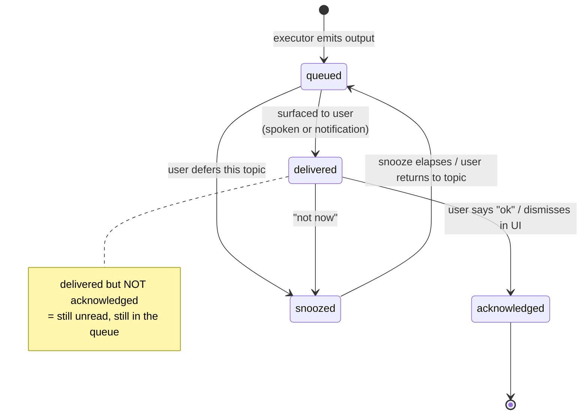
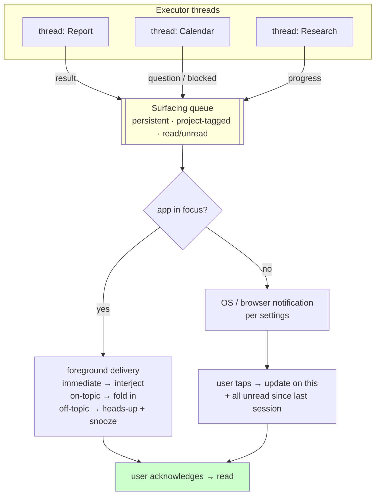
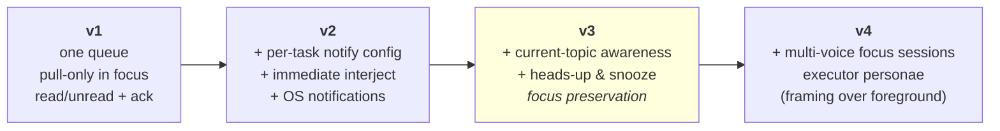
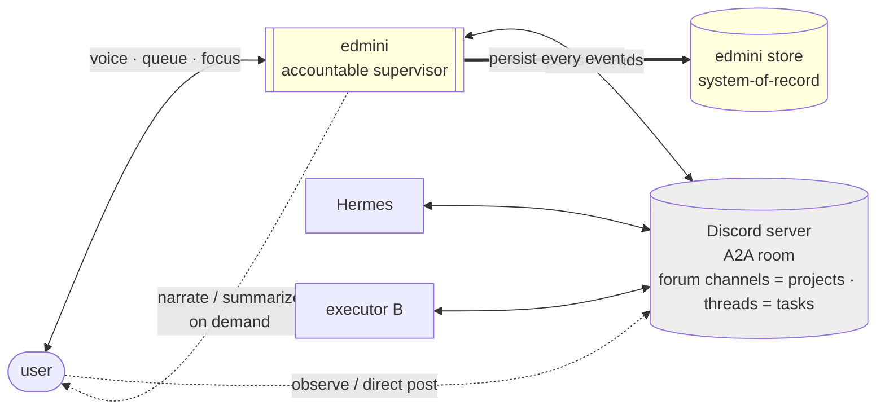

# Supervisor Thread State Model — Design (v2)

**Status:** brainstorm output, awaiting review
**Date:** 2026-05-28 (v2 revision: simplified from scoring model to configured-intent + state machine)
**Context:** edmini supervisor-side thread management for voice conversations. The model is intended to be generic enough to inform the Voice LLMs blog Post 1 §6 ("Parallel vs. Serial Paradox") without leaking edmini specifics; concrete implementation will be a downstream layered exercise (see §7).

> **v2 note.** An earlier draft scored each output with `kind × urgency × age` and surfaced when the score cleared a tuned bar. That was too clever. Urgency is something the **user configures**, not something the system deduces. v2 replaces the score with (a) a configured per-task notification preference, (b) a small state machine over outputs, and (c) a separate, persistent, project-tagged queue that guarantees nothing is lost. The supervisor's job is to **help the user hold focus**, not to guess what matters.

---

## 0. Design invariant — edmini is the accountable supervisor (Jarvis)

edmini is the **supervisor / meta-agent / personal assistant** — a Jarvis. It is the user's **primary interface** and the layer **accountable** for all the work. Other surfaces (the A2A bus, executor logs, notification transports) are **back-of-house** — but back-of-house means *edmini-owned*, not *user-forbidden*.

The invariant is **awareness, not exclusivity**: edmini must never go blind, and must always be able to account for what happened. The user normally relates to edmini; if they reach into a back-of-house surface directly — e.g. posting into a bus channel (§8) — edmini **detects and incorporates** it rather than preventing it. Prevention is brittle and, on a third-party surface like Discord, unenforceable anyway; continuous awareness is the real guarantee.

The check every downstream decision must pass: *does edmini stay aware of, and able to account for, everything that happens?* A design that could let something reach an executor — or an executor act — **without edmini seeing it** violates the invariant. A design where the user takes a different path but edmini still observes it and folds it into the ledger does not.

---

## 1. Framing

A voice supervisor sits between one human user and N executor agents working asynchronously. Output from executors arrives at unpredictable times and must reach the user through a single serialized channel: speech (when the app is in focus) or notifications (when it isn't). The cognitive ceiling on simultaneous voice threads is *not* set by how many threads exist — it is set by how often the user's current focus is broken, and by how many produced-but-unacknowledged results the user is mentally tracking.

The design rests on three ideas:

1. **Intent is configured, not inferred.** Whether a given task's result should interrupt is a property the user sets (the agent may *suggest* it). The system never tries to compute importance.
2. **Nothing is lost.** Every output lands in a persistent queue, tagged to its project/task/theme, and stays *unread* until the user explicitly acknowledges it. Focus is preserved by deferring, not by dropping.
3. **Everything leaves a trail.** edmini's role is a **manager accountable to the user**: it must be able to report what happened and why. The queue is therefore also a ledger. `silent` means *recorded but not surfaced* — never *not recorded*. As edmini grows to coordinate multiple sub-agents, the exchanges between them become outputs too; most are `silent`, but all are logged, so the manager can always reconstruct and answer for the work.

---

## 2. Two state machines

Keep the executor's lifecycle separate from the lifecycle of the *outputs* it produces. The outputs are what the user actually experiences.

### 2.1 Thread (one executor's workstream) — coarse

- `working` — executor is running; may or may not have produced output
- `blocked` — executor cannot proceed without user input (a **structural fact**, knowable for free — not a guess about importance)
- `done` — executor finished

`blocked` is deliberately distinct from any notion of urgency. "The executor is stuck" is objective. "This matters enough to interrupt me" is the user's call (§2.2, `notify`).

### 2.2 Output (a surfaceable item) — the one that matters



**`read` / `unread` is derived, not stored:** an output is *read* once it reaches `acknowledged`, and `unread` in every other state. Delivery alone does not mark it read — the user must acknowledge. This is the anti-"lost in the woods" guarantee.

**Output attributes (all known or configured — none deduced):**

- `project` — the project / task / theme this output belongs to (drives queue grouping and tagging)
- `notify` — `immediate | queued | silent`, **configured per task by the user**; the agent may suggest a value when the task is set up ("want to be told the moment this finishes?")
- `kind` — descriptive only: `result` / `question` / `progress`. A `question` from a `blocked` thread is a structural fact, not an urgency score.

---

## 3. Delivery context — app focus, not "modes"

There is no `ambient` / `focused` / `meeting` mode machinery. There are two contexts, set by whether the app is in focus, and the same queue underlies both.

### 3.1 Foreground (app active, conversation live)

- Every output lands in the **surfacing queue** (§4), tagged and `unread`. It is never silently injected into the transcript.
- If `notify == immediate` (the user pre-asked to be told): the agent interjects at the next clause boundary, naming the project. Acknowledgement is still required to clear it.
- Else if the output's `project` **is the current topic**: the agent may fold it in naturally.
- Else (output relates to a *different* project): the agent offers a lightweight **"heads up — ABC produced a result; talk about it now, or snooze?"** The default is snooze: focus is preserved unless the user opts in.
- Anything not surfaced stays in the queue as an unread badge on its project. The user pulls when ready ("what's new on ABC?").

### 3.2 Background (app inactive)

- Output triggers an OS / browser notification **per the user's notification settings** (which is essentially the same `notify` config plus OS-level preferences). No special logic.
- When the user taps a notification (or returns to the app): the agent loads context and **gives an update on that notification plus everything unread since the last session** — read straight off the queue.

The important consequence the user called out: **we don't need bespoke "meeting" logic.** A focus session with the agent is just foreground behavior; notification behavior is just settings. Meetings, if they exist as a UX, are a *framing* over foreground focus — not a separate ruleset for surfacing.

---

## 4. The surfacing queue — the heart of the design

A single structure, separate from the conversation transcript. It serves two roles at once: a **delivery queue** (what to surface, when) and an **accountability ledger** (a durable trail of everything that happened).

- **Persistent** — survives cold starts / re-logins; the place "since last login" is computed from.
- **Tagged** — every item carries its `project`, so outputs from many threads stay grouped by workstream instead of interleaving into one undifferentiated stream.
- **Read/unread** — driven by explicit acknowledgement (§2.2). Unread items do not disappear; they accumulate visibly.
- **Snooze-aware** — a deferred item is re-queued, never dropped.
- **Complete** — `silent` outputs are still recorded, just not surfaced. The ledger captures everything, including (eventually) inter-agent exchanges, so edmini can always report and answer for the work. Surfacing is a *view* over the ledger filtered by `notify` and focus — not a gate on what gets written.



Everything the old scoring model tried to compute is now either a configured flag (`notify`) or a user action (acknowledge / snooze).

---

## 5. The decision — a branch, not a score

`deliver(output)` reads three **known** inputs: the configured `notify`, whether the app is in focus, and whether the output's project is the current topic. No weights, no thresholds.

```python
def deliver(output, app, conversation):
    queue.add(output)                         # always: tagged, unread, persistent

    if not app.in_focus:                      # background
        if output.notify != "silent":
            os_notify(output)                 # per user settings
        return                                # picked up on next return / tap

    # foreground
    if output.notify == "immediate":
        interject(output)                     # name the project; ack still required
    elif output.project == conversation.current_topic:
        fold_in(output)                       # relevant to what we're discussing
    elif output.notify == "queued":
        offer_now_or_snooze(output)           # "heads up... now, or snooze?"
    # notify == "silent" in foreground: just sits as an unread badge
```

### Where the cognitive ceiling actually bites

Not at thread *count* — you can have many threads working with no cost while the app is in focus on one topic. It bites at two places the model now controls directly:

1. **Focus breaks per minute** — every `immediate` interjection and every accepted heads-up is a context switch. Because interruption is *configured* (`immediate`) or *offered then deferred* (snooze), the user — not a tuned function — owns this rate.
2. **Unread tail length** — how many produced-but-unacknowledged outputs the user is tracking. The queue makes this visible and bounded by acknowledgement, instead of letting results evaporate into the transcript.

The old "switch frequency" worry is handled structurally: off-topic outputs default to snooze, so the audible stream stays on one topic until the user chooses otherwise.

---

## 6. Pseudocode (generic, for blog §6)

```text
# state
queue            # persistent, project-tagged, items have state ∈
                 #   {queued, delivered, acknowledged, snoozed}
app.in_focus     # foreground vs background
conversation.current_topic

on output(thread, item):
    item.project = thread.project
    item.notify  = thread.notify           # configured: immediate | queued | silent
    item.state   = queued
    queue.add(item)                         # never injected silently into transcript

    if not app.in_focus:
        if item.notify != silent: os_notify(item)      # per settings
        return

    if item.notify == immediate:            interject(item)            # ack required
    elif item.project == conversation.current_topic:  fold_in(item)
    elif item.notify == queued:             offer_now_or_snooze(item)  # default: snooze

on user_acknowledges(item):  item.state = acknowledged    # "ok" / UI dismiss → read
on user_snoozes(item):       item.state = snoozed          # deferred, not lost
on app_returns_to_focus():   summarize(queue.unread())     # "since last session: ..."
```

*(`interject` / `fold_in` / `os_notify` move the item `queued → delivered`; `acknowledged` and `snoozed` proceed from there — matching the §2.2 state machine.)*

The whole argument: importance is **configured** (`notify`), focus is **preserved** by default (off-topic → snooze), and closure is **guaranteed** (acknowledged → read). No inference engine.

---

## 7. Layered versions



- **v1 — the queue.** A single persistent, project-tagged queue. In focus, the agent never interrupts; the user pulls ("what's new?"). Read requires acknowledgement. This alone solves "lost in the woods."
- **v2 — configured notification.** Per-task `notify` (agent suggests values). `immediate` interjects in focus; in background everything routes to OS notifications per settings.
- **v3 — focus preservation.** Current-topic awareness + the heads-up/snooze offer for off-topic outputs. This is where the system actively *helps hold focus* rather than just not-losing things.
- **v4 — multi-voice focus sessions.** Optional: multiple executor personae audible in a foreground session (brainstorm / decision). A framing over foreground, not a new surfacing ruleset.

The **v2 → v3** boundary is where the product stops being a tidy inbox and starts being a focus assistant.

---

## 8. Transport & agent-to-agent (v1 committed: Discord)

Two **separate** channels, by design (they have different requirements):

- **edmini ↔ user** — edmini's own framework (voice, the queue, focus). Optimizes for serial attention, latency, accountability. Covered by §2–§6.
- **edmini ↔ executors** — an A2A bus. Optimizes for throughput, structure, durability, fan-out. This section.

Forcing one substrate to serve both is the mistake to avoid. Per §0, the A2A bus is **back-of-house**: the user relates to edmini via the proprietary voice channel; the bus is where executors live, and edmini narrates it on demand (the user *may* peek/post directly — §0 awareness — but doesn't have to).

> *"v1" disambiguation: §7's v1–v4 are maturity layers of the **user-side** model. The "v1" in this section is edmini's **first shippable release**, which must pick one A2A transport. They are different axes.*



*Model (1), the messaging app **is** the A2A room: edmini and executors are all apps in one Discord server; everyone posts and reads (app-to-app visibility works — unlike Telegram); the human can observe or post; edmini persists every event to its own store as the system-of-record. (The alternative — **Model (2)** — keeps a typed protocol underneath and uses the app only as a human-readable mirror; that is the graduation path at the end of this section, not v1.)*

### Which messaging app — grounded in how executors actually work

The executors edmini coordinates (Hermes, OpenClaw, …) are **multi-channel gateways**, not single-app bots. One brain, reachable from ~5–20 messaging apps; the user connects whatever they already use. OpenClaw runs "1 Gateway process that receives messages from every connected channel and routes them into the same session store"; Hermes is "run the gateway and talk to it from Telegram, Discord, Slack, WhatsApp, Signal, SMS, Email…". So there is **no single dominant app** — the *trend* is the gateway pattern itself.

That changes the question from "which app is most popular" to "which app both (a) the executors support **and** (b) lets edmini actually *read* another agent." The second filter is the bot-to-bot visibility issue:

| Channel | Executors support | App-to-app visibility (edmini reads executor) | Cost / API fit for read-heavy 3rd-party app | A2A verdict |
|---|---|---|---|---|
| **Discord** | first-class (buttons, forum channels, threads) | ✅ yes (`author.bot` flag) | free, no per-seat, generous gateway limits, persistent readable history | **✅ v1 pick** |
| **Slack** | first-class (slash commands, Socket Mode) | ✅ yes (filter own `bot_id`) | ⚠️ per-seat paid; **`conversations.history`/`replies` throttled to 1 req/min · 15 msgs for non-Marketplace apps (May 2025)** — breaks catch-up | ⚠️ viable in theory, **blocked in practice** |
| **Telegram** | supported | ❌ bot-to-bot delivery blocked, no setting fixes it | (n/a) | ❌ not an A2A bus |
| **WhatsApp / Signal** | supported | ❌ 1:1 / E2E, no real multi-agent room | (n/a) | ❌ unfit for A2A |

Two channels clear the visibility filter (Slack, Discord), but only one clears it **in practice**. Slack's May 2025 throttle of `conversations.history`/`conversations.replies` to **1 request/min, max 15 messages** for non-Marketplace apps targets exactly edmini's pattern (an unvetted third-party app reading lots of conversation), and collides head-on with the **catch-up requirement** below (backlog reconciliation needs history reads). Add per-seat cost — a barrier to merely *trying* edmini — and Slack is out for v1 unless/until Marketplace-approved. Telegram is the YouTube tutorial default only because it nails the *1-user ↔ 1-bot* personal-UI case, where its bot-to-bot blindness never surfaces; edmini's multi-agent room is the opposite case.

**v1 commitment: Model (1) on Discord.** Free (no per-seat → low barrier to try, which matters for adoption), volume-tolerant, app-to-app visible, **forum channels = projects, threads = tasks** (§4 tagging for free), components for ack/snooze, and persistent readable history that doubles as the browsable accountability ledger (§1, idea 3). Executors post, edmini reads them natively, the human watches and can chime in.

**Human-readable now is a hard v1 requirement** (product call): Model (1) — the app *is* the room — satisfies it directly. A lower-level / typed integration is **certain** in the future and is the documented graduation path (below); it trades visibility for throughput and is explicitly deferred, not forgotten.

The residual cost is unchanged and real: third party in the **control plane**, rate limits and latency (fine for human-paced coordination, a problem only under heavy agent chatter — a graduation trigger). Two disciplines regardless:

- **Thin adapter.** edmini talks to executors through an internal port — `dispatch(task)` / `on_output(…)`. Discord is one backend; the executor's **gateway / CLI / MCP** is another (Hermes exposes these, e.g. an MCP integration via Composio). v1 uses the Discord route for the human-visible requirement; the typed route is the graduation path. Swapping is then a config change, not a rewrite.
- **edmini's own store is the system-of-record.** The Discord room is the human-facing *view* + the live bus; edmini persists every event so the accountability trail — the **same ledger as §4** (one trail, two altitudes: user-side outputs and A2A traffic) — is never hostage to the platform's retention or access.

**Sources:** [OpenClaw (GitHub)](https://github.com/openclaw/openclaw), [OpenClaw multi-channel setup](https://lumadock.com/tutorials/openclaw-multi-channel-setup), [Hermes Agent (Nous Research)](https://hermes-agent.nousresearch.com/), [Hermes — Messaging Gateway](https://hermes-agent.nousresearch.com/docs/user-guide/messaging/), [Telegram MCP with Hermes (Composio)](https://composio.dev/toolkits/telegram/framework/hermes-agent), [Slack rate-limit changes for non-Marketplace apps (May 2025)](https://docs.slack.dev/changelog/2025/05/29/rate-limit-changes-for-non-marketplace-apps/).

**Awareness resolution (per §0): edmini stays aware; the user isn't fenced out.** There are three ways the user can reach an executor, and edmini sees all three:

- **edmini-authored (default).** edmini decides what to send an executor based on the conversation — it *is* the agent.
- **Verbatim relay (explicit).** The user — typically mid-voice-conversation with edmini — dictates an exact message and edmini passes it through, attributed "from the user, verbatim." Useful when precision matters and a paraphrase would be lossy, e.g. answering a `blocked` thread's question (§2.2): edmini surfaces "Hermes is asking X," the user says "answer: …," edmini relays exactly.
- **Direct post (allowed).** The user posts into a room channel/thread themselves. Because edmini is a **distinct app** in the server (it posts as itself, never as the user), the post is **attributed automatically by account identity** — no tagging needed — and edmini folds it into its ledger and reacts as needed.

The **read-side dual** holds: the user can ask edmini for an executor's *raw* output, not just a summary ("read me exactly what Hermes said").

Two requirements make "edmini sees all three" true rather than assumed:

- **App visibility.** edmini's Discord app must enable the message-content intent and have access to the relevant channels, and filter its own author id to avoid loops. On Discord this covers *executor* messages too (`author.bot` distinguishes them) — the app-to-app visibility Telegram lacks. (If the transport ever adds Telegram for the human-notification leg, recall its bot-to-bot wall: a bot reads other *bots* never, and *users* only when admin/privacy-off.)
- **Catch-up.** edmini must reconcile posts made while it was offline (backlog/history fetch on reconnect), not only live events, so the ledger stays complete.

One accepted race: a fast executor may act on a direct user post *before* edmini has folded it in. Tolerable — edmini is not a gate; it still records both the post and the consequence, it just learns slightly after the fact.

**Graduate from Model (1) to a typed protocol (with the app as mirror) when** any trips: inter-agent message rate hits throttles; you need correlated request/response or structured payloads; data sensitivity rises; or nested task decomposition (epic → task → subtask) strains flat channels/threads.

---

## 9. Explicitly not committed to

- The exact `notify` vocabulary and how the agent *suggests* a value at task-setup time.
- Snooze granularity (time-based? until-topic-returns? until-asked?).
- How `current_topic` is tracked across a winding conversation (probably its own brainstorm — supervisor-side topic/project classification).
- Notification de-duplication / batching when many outputs land at once in background.
- Whether `blocked` threads get a distinct default `notify` (structurally they often should, but that's a default, not a deduction).
- **Inter-agent communication protocol.** §8 commits a v1 *transport* (Discord room as the bus) but defers the real protocol — addressing, request/response correlation, which exchanges ever become user-facing. The principle that survives regardless: every exchange is logged, so there is always a trail. The certain future move to a lower-level/typed integration is the documented graduation path (it trades human-visibility for throughput).
- **Whether to support more than one channel.** v1 is Discord. Whether to later add Telegram for the *user-notification* leg (where its bot-to-bot wall doesn't bite) or other channels is left open — all behind the thin adapter.
- **Interjection guardrails.** Direct posts and verbatim relays are attributed automatically (account identity) and always logged. Open: whether edmini ever *warns* when a user instruction — relayed or direct-posted — conflicts with current coordination, or always stays a faithful conduit. Default leaning: relay/observe faithfully + log, warn only if asked — edmini is a conduit, not a censor.
- **App-visibility & catch-up hardening.** §8 requires edmini's Discord app to have the message-content intent and channel access, and to reconcile offline backlog. The exact reconnect/replay (history-fetch) mechanism, and how the accepted "executor acts before fold-in" race is surfaced (if at all), are left open.

---

## 10. Mapping back to the original questions

| Question | Where it lives in v2 |
|---|---|
| Supervisor's job when multiple agents want voice | the surfacing queue + `deliver()` branch (§4, §5) |
| User mid-utterance to A, B has pending output | B's output sits `queued`/`delivered`-unread; surfaces per `notify` and topic (§3.1) |
| Re-entering a parked thread | `snoozed → queued`; pulled via "what's new on ABC?" or topic return (§2.2) |
| Barge-in across vs. within thread | within-topic = `fold_in`; across-topic = heads-up + snooze, never a silent cut-in (§3.1) |
| Where the cognitive ceiling bites | focus breaks per minute (user-configured) + unread tail length (queue-bounded) (§5) |
