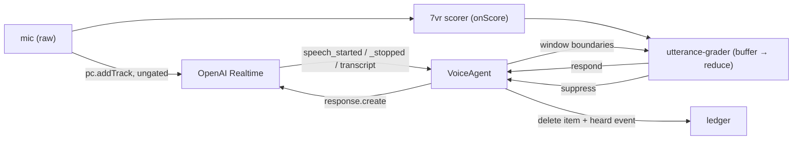

# Grade-and-Suppress — Parallel Speaker-Confidence Response Gate — Design Spec

**Date:** 2026-06-21 · **Status:** approved-pending-review · **Bead:** `edmini-qo3` v0 (new impl bead; depends on `edmini-7vr`)
**Depends on:** `edmini-7vr` (target-speaker VAD engine — validated) · **Frames:** `conversational-presence.md` (the *contribute* gate)
**Relates:** `edmini-1c8` (echoCancellation — removes most of Ed's own echo upstream of this)

## Context

edmini should **respond only to its enrolled user**, not bystanders, a TV, or its own voice echoed back
on speakerphone (the feedback loop). The target-speaker VAD engine (`7vr`) is validated — it grades the
enrolled user's voice high (live English self-score 0.4–0.6+) and others low (offline margin 0.69).

**The integration is NOT an inline mic gate.** Live testing showed inline gating clips word onsets by
~1 s — speaker-ID intrinsically needs ~¾–1 s of voiced audio to build a confident d-vector (600 ms
scoring window + 250 ms EMA half-life climb past the 0.45 threshold). For a latency-critical voice loop
that's unusable. So:

> **TS-VAD runs in *parallel* and *grades* each utterance; it never sits in the audio path.** OpenAI gets
> the **raw mic stream** (zero added latency, no clipping). At turn-end edmini reads the per-utterance
> confidence and decides whether Ed responds.

The ~1 s "ramp to confidence" stops mattering because we grade the **completed** utterance (after
OpenAI's ~800 ms end-of-speech silence) — there's the whole utterance to average over. This is the first
concrete rung of the conversational-presence **contribute** gate (`qo3`).

## Architecture

Three units, each independently testable:

1. **Scorer** — the existing `7vr` pipeline (`createBrowserTargetSpeakerVad`), run **for its `onScore`
   stream only**. We do **not** use `getProcessedStream()`; the raw mic goes to OpenAI. (The gate
   worklet still runs as the frame-tap that feeds scoring; its gain output is simply ignored. A future
   "score-only" mode can skip applying gain — out of scope here.)
2. **Grader** (new, pure) — `src/lib/voice/utterance-grader.ts`: buffers per-window scores for the
   in-flight utterance and, at turn-end, reduces them to a **decision** (`respond | suppress`) under a
   policy. Pure and unit-tested; no React, no OpenAI.
3. **Response gate** (VoiceAgent + session config) — OpenAI runs VAD/transcription but **does not
   auto-respond** (`turn_detection.create_response:false`); edmini explicitly drives the response only
   when the grader says `respond`.



## Data flow (one user turn)

```
input_audio_buffer.speech_started   → grader.beginUtterance(now)
(while speaking) vad.onScore(s)      → grader.addScore(s)        // raw cosine per ~160ms window
input_audio_buffer.speech_stopped    → grader.endUtterance(now) → { decision, confidence, windows }
input_audio_buffer.committed         → capture item_id          // server auto-committed; do NOT send commit
   ├─ respond:  fireResponse(response.create, { metadata:{ src:"client" } })   // existing serialized path
   └─ suppress: conversation.item.delete(item_id)               // keep it out of Ed's context
                ledger: { source:"user", kind:"heard", payload:{ confidence, text? } }
```

The grade is *ready* at `speech_stopped` (all scores are in), but we **act on
`input_audio_buffer.committed`** — that's where the canonical `item_id` lands, needed for either path
(suppress deletes it; respond fires after it so the user item provably exists). Server-VAD **auto-commits**
the user audio even with `create_response:false`; we never send `input_audio_buffer.commit`. On
`suppress` we **delete that item** so a bystander/echo never pollutes Ed's working context, and log a
**`heard`** ledger event so the *record* survives (the conversational-presence "capture" rail; enables
decide-later promotion later — not built here). Transcript (for the `heard` payload) arrives on
`conversation.item.input_audio_transcription.completed`, slightly after — log it then if suppressed.

> **Considered alternative — speculative pre-authorization (deferred).** *What it means:* once the
> grade is confidently "the user" partway through an utterance, flip `create_response` to `true` in
> advance (via `session.update`) so OpenAI auto-responds the instant the turn ends, with no client
> trigger round-trip at all. *Why deferred:* it would decide on the **least-reliable early-ramp
> windows** (less accurate than grading the full utterance), and the mid-utterance `session.update`
> races the turn-end (risking dead air or a double response) and any speaker change after the flip. The
> manual path is already ~zero perceptible latency — the decision is *precomputed in parallel*, so the
> client just fires `response.create` immediately on `committed`. Revisit only if that trigger
> round-trip proves perceptible on device, and gate the flip on *sustained* confidence, not first.

**Clock alignment** is coarse-but-sufficient: buffer the `onScore` samples that arrive (by
`performance.now()`) between the `speech_started` and `speech_stopped` data-channel events. Utterance-
level averaging makes the few-ms event skew irrelevant.

## Grade policy (`utterance-grader.ts`)

Input: the raw per-window cosine scores collected during the utterance + their voiced flags. Output: a
decision. Default policy (all tunable constants, seeded from validated data):

- **Aggregate:** mean cosine over **voiced** windows (skip silence windows — they're not speaker
  evidence). Optionally also track the max.
- **Decision:** `respond` if `meanVoiced ≥ RESPOND_THRESHOLD` (start ~**0.35**, below the gate's 0.45
  since we average a clean full utterance, not a cold-start ramp — final value set from on-device data).
- **Short-utterance fallback (allow-if-uncertain):** if `voicedWindows < MIN_WINDOWS` (≈ < ~0.7 s of
  speech, too short to grade) → **`respond`**. Rationale: a missed bystander (false respond) is a minor
  blip; refusing the *user's* quick "yes/stop" is a bad failure. Bias to inclusion when uncertain — the
  conservative-speak-gate principle is affordable here precisely because we're not gating audio.
- **Pre-enrollment:** no centroid → every score is null → **always `respond`** (pass-through; today's
  behavior). Grading only engages once enrolled.

The grader is a pure reducer: `createUtteranceGrader(policy?) → { beginUtterance, addScore, endUtterance() }`.

## Components

- **`src/app/api/session/route.ts`** — add `create_response: false` (and keep `interrupt_response`
  default) to `turn_detection`. *Only when grading is active* (enrolled + flag on) — otherwise leave
  auto-response on so the plain voice loop is unchanged. (The session is created per-connection, so the
  client can request the right mode; pass a flag in the POST body.)
- **`src/lib/voice/utterance-grader.ts`** (new, pure) + tests — buffer/reduce/policy as above.
- **`src/components/VoiceAgent.tsx`** — when grading is enabled: start the `7vr` scorer on the mic
  (raw mic still feeds `pc.addTrack`); wire `onScore` + the speech_started/stopped/item events into the
  grader; on `respond` use the existing `fireResponse`; on `suppress` delete the item + POST a `heard`
  event; add `VoiceEnrollment` to onboarding; tear down the scorer in `stopSession`.
- **`src/app/api/voice-output/route.ts` or a small `/api/heard` route** — service-role append of a
  `heard` event (mirror `voice-output`). (Reuse the existing ledger writer pattern.)
- **Enrollment** — reuse `7vr`'s `VoiceEnrollment` component (localStorage centroid) in the voice
  onboarding, behind the same flag.

> **✓ Verified against the current Realtime API (2026-06-21).** This is OpenAI's *documented intended
> pattern* for manual response control, not a workaround. Exact mechanics:
> - **Config:** `session.audio.input.turn_detection.create_response: false` suppresses the auto-response
>   while keeping server-VAD + transcription. Keep **`interrupt_response: true`** (default) so the user
>   can barge-in/interrupt Ed naturally (see Edge cases). `gpt-realtime`/`gpt-realtime-2` only —
>   `gpt-realtime-whisper` needs `turn_detection: null` and is incompatible.
> - **Do NOT send `input_audio_buffer.commit`** — server-VAD auto-commits on speech-stop. The canonical
>   user-item `item_id` arrives on **`input_audio_buffer.committed`** (handle both
>   `conversation.item.created` and the GA `conversation.item.added/.done`).
> - **No hidden per-turn timeout** — fire `response.create` promptly on `committed` to avoid dead air
>   (leave `idle_timeout_ms` unset). Tag client-initiated responses with `metadata` (no server "who
>   initiated" field) so the `response.cancel` fallback can tell them apart.

## Config & default state

- **Opt-in, default OFF.** A client flag (localStorage, surfaced in the UI) enables grading. Off →
  today's behavior exactly (auto-response, no scorer). This ships safely dark and is flipped on per the
  user's device test.
- **Pass-through until enrolled.** Flag on but no enrollment → scorer runs but every utterance grades
  `respond` (so Ed still works); the UI prompts to enroll for the gate to bite.

## Self-suppression / echo

`echoCancellation` (`1c8`) already removes most of Ed's own TTS from the mic upstream of the scorer. Any
residual that leaks through grades **low** (it isn't the enrolled user) → `suppress`. Belt-and-suspenders;
the grader needs no special "is this Ed" logic — "not the user" is sufficient.

## Edge cases

- **Barge-in (user interrupts Ed):** `interrupt_response:true` (default) means *any* speech-start
  cancels Ed's current response — so the user can naturally cut Ed off. The follow-up response is still
  **graded** (`create_response:false`), so only the user gets a reply. **Accepted v0 caveat:** a loud
  bystander can also *interrupt* Ed (just stops him — harmless; he won't *answer* them). `echoCancellation`
  keeps Ed's own echo from self-interrupting. "Only the user may interrupt" (manual interrupt via
  `response.cancel` gated on a high barge-in grade) is a later refinement — grading a barge-in fast
  enough is the ~1 s-ramp problem, so v0 keeps auto-interrupt.
- **Overlapping speech (user + bystander):** mean cosine sits between → near the threshold. v0 accepts
  the threshold's call; refinement (per-window max, diarization) is later.
- **Scorer/model failure** (ONNX load fails, embed throws): **fail OPEN** — grade `respond` for every
  utterance and surface a one-line error. Never lock the user out of their own assistant.
- **Very short utterances:** handled by the allow-if-uncertain fallback.

## Testing / Verification

- **Unit (pure):** `utterance-grader` — mean-over-voiced, respond/suppress threshold, short-utterance
  fallback, pre-enrollment pass-through, empty/all-silence input. Deterministic score arrays.
- **Integration:** a mock score stream + mock OpenAI events drive the VoiceAgent decision path (respond
  fires `response.create`; suppress deletes the item + posts `heard`).
- **Live (device, enrolled):** (a) you speak → Ed responds; (b) a bystander / a recording of Ed on
  speaker → Ed stays silent, a `heard` event lands, no context pollution; (c) a quick "stop" → Ed
  responds (short-utterance fallback); (d) flag off → unchanged behavior. tsc/test/build green.

## Out of scope (later rungs)

- **Decide-later / retroactive promotion** ("edmini, that was for you" pulling a suppressed `heard`
  utterance back) — the `heard` events lay the rail; the promotion logic + rolling buffer are deferred.
- **Multi-input / channel-as-role**, per-speaker `from` attribution, Speechmatics parallel stream —
  conversational-presence v2+.
- **"Score-only" scorer mode** (skip the gate worklet's gain application) — a minor optimization.
- **Threshold auto-tuning** — start with constants from the device test; revisit if needed.
